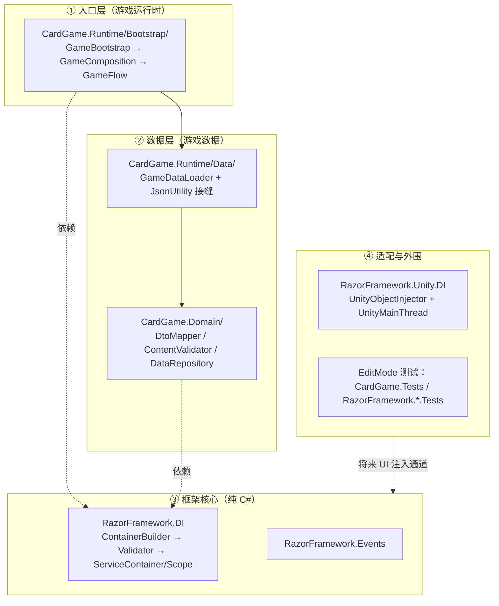

# CardGame 代码阅读顺序

> **目的：** 按数据流与依赖方向给出阅读路线，让协作者在最短路径上建立源码逻辑的心智模型。
> **更新准则：** 程序集或目录结构变更时（新增模块、移动文件、增减 asmdef），同步本文件的路线与文件清单。
> **配套阅读：** 架构结论以 [docs/design/README.md](design/README.md) 为准；本文件只负责"先看哪个文件、看什么"。

## 分层总览

阅读总原则：**从入口往依赖走**（L1 → L2 → L3），先知道"谁启动了什么、数据从哪来"，再钻进框架实现；框架层按"先消费者视角、后实现细节"读。适配层与测试放在最后作为背书与预留接口。

## 第 1 站：游戏入口（先看"谁启动了什么"）

| 顺序 | 文件 | 看点 |
|---|---|---|
| 1 | [Assets/CardGame/Runtime/CardGame.Runtime/Bootstrap/Scopes.cs](../Assets/CardGame/Runtime/CardGame.Runtime/Bootstrap/Scopes.cs) | 两个作用域标记 `RunScope` / `EncounterScope`——整个 DI 生命周期语义的锚点（单局 ⊃ 遭遇） |
| 2 | [Assets/CardGame/Runtime/CardGame.Runtime/Bootstrap/GameBootstrap.cs](../Assets/CardGame/Runtime/CardGame.Runtime/Bootstrap/GameBootstrap.cs) | 场景唯一入口（单场景形态）：Awake = 加载数据 → 建组合根 → 显式启动；OnDestroy = 确定性释放 |
| 3 | [Assets/CardGame/Runtime/CardGame.Runtime/Bootstrap/GameComposition.cs](../Assets/CardGame/Runtime/CardGame.Runtime/Bootstrap/GameComposition.cs) | **组合根**：DefineScope + 代码注册 + `Build()`。注册从可变 builder 变成不可变容器的那一刻 |
| 4 | [Assets/CardGame/Runtime/CardGame.Runtime/Bootstrap/GameFlow.cs](../Assets/CardGame/Runtime/CardGame.Runtime/Bootstrap/GameFlow.cs) | 显式启动点——"构造即初始化 + 显式 Start"屏障语义的落点（当前是占位流程服务） |

**读完自检：** 容器在哪儿创建？服务在哪儿注册？谁第一个执行、退出时按什么顺序释放？

## 第 2 站：数据从文件到仓库（游戏数据怎么进来）

| 顺序 | 文件 | 看点 |
|---|---|---|
| 5 | [Assets/CardGame/Runtime/CardGame.Runtime/Data/GameDataLoader.cs](../Assets/CardGame/Runtime/CardGame.Runtime/Data/GameDataLoader.cs) | 管线入口：8 个固定文件名遍历 → 逐个解析 → **错误聚合**（错误汇非空即抛 `DataValidationException`，不 fail-fast）；TextAsset 键补 `.json` 的细节 |
| 6 | [Assets/CardGame/Runtime/CardGame.Runtime/Data/JsonUtilityGameDataSerializer.cs](../Assets/CardGame/Runtime/CardGame.Runtime/Data/JsonUtilityGameDataSerializer.cs) | 序列化接缝：全项目唯一接触 `JsonUtility` 的位置（换 Addressables/其他序列化只改这里） |
| 7 | [Assets/CardGame/Runtime/CardGame.Domain/Mapping/DtoMapper.cs](../Assets/CardGame/Runtime/CardGame.Domain/Mapping/DtoMapper.cs) | **DTO → 类型化模型**：未知枚举记错误 + 回退值继续映射；`condition.type` 非空判定（JsonUtility 幻影条件防护） |
| 8 | [Assets/CardGame/Runtime/CardGame.Domain/Mapping/EnumMaps.cs](../Assets/CardGame/Runtime/CardGame.Domain/Mapping/EnumMaps.cs) | 字符串 → 枚举映射表（大小写敏感、精确匹配、未知值交调用方记错误） |
| 9 | [Assets/CardGame/Runtime/CardGame.Domain/Model/Types.cs](../Assets/CardGame/Runtime/CardGame.Domain/Model/Types.cs) 与 [Assets/CardGame/Runtime/CardGame.Domain/Model/Dtos.cs](../Assets/CardGame/Runtime/CardGame.Domain/Model/Dtos.cs) | 领域模型与磁盘 JSON 形态的对应：纯 C#、不可变、id 索引（先 Types 后 Dtos） |
| 10 | [Assets/CardGame/Runtime/CardGame.Domain/Repository/DataRepository.cs](../Assets/CardGame/Runtime/CardGame.Domain/Repository/DataRepository.cs) 与 [Assets/CardGame/Runtime/CardGame.Domain/Repository/DataRepositoryBuilder.cs](../Assets/CardGame/Runtime/CardGame.Domain/Repository/DataRepositoryBuilder.cs) | 仓库冻结管线：world 缺失检查 → `ContentValidator` 交叉引用校验 → `DescriptionBuilder` 生成文案 → 冻结为 id 索引仓库 |

**读完自检：** 一份 JSON 经过哪些变换变成可查询仓库？每步的错误在哪儿暴露（映射期汇入 loader 的错误汇 / 校验期抛独立异常）？

## 第 3 站：DI 核心（关键一跳：从用法进实现）

先读 `GameComposition` 已见过消费者视角的用法，现在进入内部。**建议把 `DependencyGraphValidator` 当作重点精读**——它是"写错就构建失败"这一价值主张的实现。

| 顺序 | 文件 | 看点 |
|---|---|---|
| 11 | [Assets/Plugins/RazorFramework/DI/ContainerBuilder.cs](../Assets/Plugins/RazorFramework/DI/ContainerBuilder.cs) | 注册面：AddSingleton/Transient/Scoped、AddCollection、DefineScope、外部实例（`AddSingleton(instance)` 归调用方） |
| 12 | [Assets/Plugins/RazorFramework/DI/DependencyGraphValidator.cs](../Assets/Plugins/RazorFramework/DI/DependencyGraphValidator.cs) | **重点**：构建期一次性五组校验（注册唯一/构造器选择/依赖图 DFS 缺失与环/作用域树/captive 生命周期），产出不可变 `ContainerBuildModel` |
| 13 | [Assets/Plugins/RazorFramework/DI/ActivationPlan.cs](../Assets/Plugins/RazorFramework/DI/ActivationPlan.cs) | 激活计划：每个服务"怎么构造、归谁所有、锚定哪个 scope"在构建期算好（RequiredScopeType/Path） |
| 14 | [Assets/Plugins/RazorFramework/DI/ServiceContainer.cs](../Assets/Plugins/RazorFramework/DI/ServiceContainer.cs) | 运行时解析面：Resolve/TryResolve/ResolveAll、CreateScope、确定性逆序释放、Dispose 后 ContainerDisposed |
| 15 | [Assets/Plugins/RazorFramework/DI/ServiceScope.cs](../Assets/Plugins/RazorFramework/DI/ServiceScope.cs) | 子作用域：祖先服务查找（FindAncestor）、Scoped 锚定声明 scope、子作用域逆序释放 |
| 16 | [Assets/Plugins/RazorFramework/DI/LifetimeOwner.cs](../Assets/Plugins/RazorFramework/DI/LifetimeOwner.cs) | 所有权模型：为什么 Singleton 归根、Scoped 归声明 scope、Transient 归解析处 |
| 17 | [Assets/Plugins/RazorFramework/DI/Diagnostics.cs](../Assets/Plugins/RazorFramework/DI/Diagnostics.cs) 与 [Assets/Plugins/RazorFramework/DI/DependencyInjectionException.cs](../Assets/Plugins/RazorFramework/DI/DependencyInjectionException.cs) | 诊断事件（DiDiagnosticKind/sink）与结构化错误（Code + ServiceType/ImplementationType/DependencyPath） |

**读完自检：** 一次 `Resolve` 背后发生什么？一次 `Dispose` 释放什么？为什么"Singleton 捕获局内状态"会被 `Build()` 拦住（而不是第 2 局游玩时才炸）？

## 第 4 站：适配层与测试（背书与预留接口）

| 顺序 | 文件 | 看点 |
|---|---|---|
| 18 | [Assets/Plugins/RazorFramework/Unity/DI/UnityObjectInjector.cs](../Assets/Plugins/RazorFramework/Unity/DI/UnityObjectInjector.cs) 与 [Assets/Plugins/RazorFramework/Unity/DI/UnityMainThread.cs](../Assets/Plugins/RazorFramework/Unity/DI/UnityMainThread.cs) | Unity 适配层：主线程守护（fail-closed）、`[Inject]`/`[InjectOptional]` 成员注入——**目前无消费者，读懂 = 看懂将来 UI 接 DI 的预留通道** |
| 19 | [Assets/Plugins/RazorFramework/Events/IEventCenter.cs](../Assets/Plugins/RazorFramework/Events/IEventCenter.cs) 与 [Assets/Plugins/RazorFramework/Events/EventManager.cs](../Assets/Plugins/RazorFramework/Events/EventManager.cs) | 事件总线：锁内取快照、锁外分发；战斗引擎（效果结算顺序）的地基 |
| 20 | [Assets/CardGame/Tests/EditMode/Bootstrap/GameCompositionTests.cs](../Assets/CardGame/Tests/EditMode/Bootstrap/GameCompositionTests.cs) | 组合根的"预期行为"测试（第 1 站的背书） |
| 21 | [Assets/CardGame/Tests/EditMode/Data/DataTestFactory.cs](../Assets/CardGame/Tests/EditMode/Data/DataTestFactory.cs) | 测试数据工厂——读任何数据层测试前先认识它，省一半理解成本 |

## 阅读建议

- **先跑后读**：读第 1 站前，在 Unity 里跑一次 EditMode 的 `GameCompositionTests`（或直接进 Play 模式），建立"运行中发生了什么"的直觉。
- **对照 UML 图**：第 2 站对照 [07-cardgame.md](design/07-cardgame.md) 的「数据管线工作原理」流程图；第 3 站对照 [01-di.md](design/01-di.md) 的三张图（构建校验流程 / 作用域解析时序 / 释放顺序）——图是这些文件行为的摘要。
- **测试先行原则**：读实现前先扫对应测试的测试名（[Assets/Plugins/RazorFramework/Tests/EditMode/](../Assets/Plugins/RazorFramework/Tests/EditMode/) 与 [Assets/CardGame/Tests/EditMode/](../Assets/CardGame/Tests/EditMode/)），等于先看契约再看实现。
- **何时可以停**：只想用框架（写玩法）→ 读完第 1、2 站即可；要改 DI 行为 → 才需要第 3 站全部；要接 UI/输入 → 第 4 站第 18 项。

## 覆盖范围与边界

- 本文件覆盖 [Assets/Plugins/RazorFramework/](../Assets/Plugins/RazorFramework/)（DI/Events/Unity.DI）与 [Assets/CardGame/Runtime/](../Assets/CardGame/Runtime/)（Domain/Runtime）的**源码阅读导航**。
- 不含：验证体系（见 [docs/HARNESS.md](HARNESS.md)）、游戏数据契约（见 [docs/CONTRACT.md](CONTRACT.md)）、架构决策（见 [docs/design/README.md](design/README.md)）。
- 未来战斗引擎（伤害管线/属性组件，决策规格 §1.1 方向）落地后，在本文件新增站点，插入第 1 站与第 2 站之间（它是 GameFlow 启动后的第一个真实领域消费者）。
