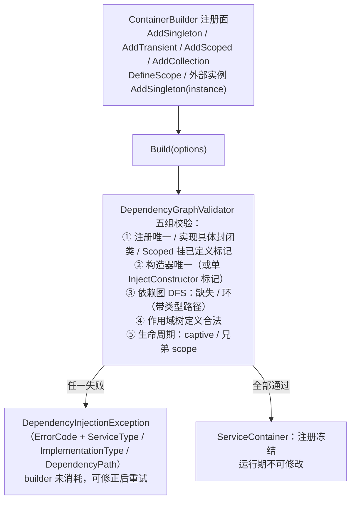
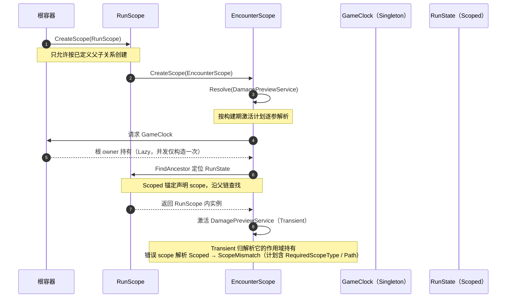
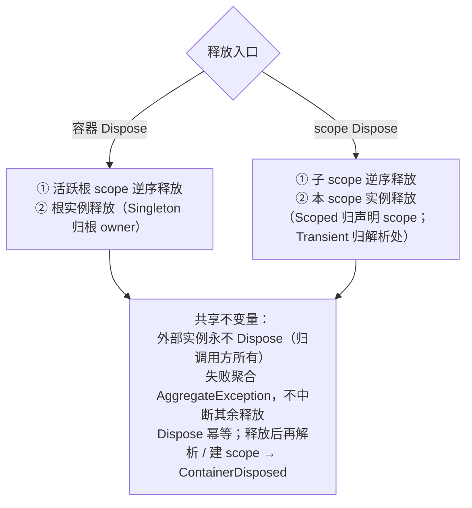

# DI — 依赖注入核心与 Unity 适配器

> 程序集：`RazorFramework.DI`（纯 C#，`noEngineReferences: true`，零引用）／ `RazorFramework.Unity.DI`（Unity，refs DI，`autoReferenced: false`）
> 位置：`Assets/Plugins/RazorFramework/DI/`、`Assets/Plugins/RazorFramework/Unity/DI/`
> 状态：✅ 编译域（feat-002 完成） · 游戏唯一 DI 实现，根目录旧 `DI/` 已删除

## 结构总览

```text
DI 体系
├─ RazorFramework.DI（纯 C# 核心，BCL only）
│  ├─ 注册面     ContainerBuilder
│  ├─ 构建校验   DependencyGraphValidator → ContainerBuildModel
│  ├─ 运行时     ServiceContainer / ServiceScope / LifetimeOwner
│  ├─ 计划模型   ActivationPlan / DependencyPlan / ServiceRegistration / ScopeDefinition
│  ├─ 诊断       DiDiagnosticEvent / IDiDiagnosticSink / DiagnosticDispatcher
│  └─ 错误模型   DependencyInjectionException / DependencyErrorCode
└─ RazorFramework.Unity.DI（Unity 适配层）
   ├─ UnityObjectInjector       成员注入
   ├─ UnityMainThread           主线程身份
   ├─ InjectAttribute / InjectOptionalAttribute
   └─ UnityInjectionException / UnityInjectionErrorCode
```

## 注册 API（ContainerBuilder）

```text
ContainerBuilder
├─ 生命周期注册
│  ├─ AddSingleton<TService, TImpl>() / AddSingleton<TImpl>()
│  ├─ AddTransient<TService, TImpl>() / AddTransient<TImpl>()
│  └─ AddScoped<TService, TImpl, TScope>() / AddScoped<TImpl, TScope>()
├─ 外部实例     AddSingleton<TService>(instance)   容器不 Dispose，归调用方
├─ 集合注册     AddCollection{Singleton|Transient|Scoped}
│              消费：ResolveAll<T>() / 构造参数 IReadOnlyList<T>
├─ 作用域定义   DefineScope<T>() / DefineScope<T, TParent>()
└─ Build(options) → ServiceContainer
   ├─ 构建后冻结（运行中不得改注册）
   ├─ 校验失败不消耗 builder（可修正后重试）
   └─ options.DiagnosticSink 观察用，不改容器行为
```

## 构建期校验（DependencyGraphValidator）

```text
Build() 时一次性校验，任一失败即抛结构化异常
├─ 注册校验
│  ├─ 默认服务唯一（重复 → DuplicateRegistration）
│  ├─ 实现必须具体封闭类且可赋值（抽象/接口/开放泛型 → InvalidImplementation）
│  └─ Scoped 必须挂已定义 scope 标记
├─ 构造器选择
│  ├─ 单公共构造器，或单 [InjectConstructor] 标记公共构造器
│  └─ 多公共未标记 / 多标记 / 标记非公共 → AmbiguousConstructor
├─ 依赖图 DFS（构造参数解析，IReadOnlyList<T> 识别为集合依赖）
│  ├─ 缺失依赖 → MissingDependency（带类型路径）
│  └─ 依赖环 → CircularDependency（带类型路径）
├─ 作用域树
│  └─ 重复定义 / 父标记未定义 / 定义环 → InvalidScopeDefinition
└─ 生命周期校验（防 captive，见下）
```

*图示：构建期校验与冻结流程（图示辅助，细节以正文为准）*



## 运行时解析与生命周期

*图示：层级作用域中的解析路径（图示辅助，细节以正文为准）*



```text
解析语义
├─ Resolve / TryResolve / ResolveAll<T>（保持注册顺序，空集合安全）
├─ 构造注入：按计划逐参解析；激活失败包装 ActivationFailed（保留原异常）
├─ 计划携带 RequiredScopeType/Path（构建期计算，Transient 继承依赖需求）
│  └─ 运行期在错误 scope 解析 Scoped 服务 → ScopeMismatch
└─ 线程安全：容器/作用域 _lifecycleGate；单例 Lazy(ExecutionAndPublication)

作用域层级
├─ CreateScope<TScope>() 只允许按已定义父子关系创建（直接父不符 → ScopeMismatch）
├─ 子作用域可用祖先服务；反向访问构建期或解析期失败
└─ FindAncestor 沿父链定位 Scoped 服务的锚定 scope

生命周期校验（构建期防 captive）
├─ Singleton 捕获 Scoped（含经 Transient/集合传递）→ CaptiveDependency
├─ Scoped 依赖后代 scope → CaptiveDependency
├─ 服务要求兄弟 scope（不可合并）→ ScopeMismatch（路径含两侧链）
└─ 计算每个激活计划的 RequiredScopeType/Path

释放模型（确定性、逆序、聚合错误）
├─ Singleton → 根 owner；Scoped → 声明 scope；Transient → 解析处 scope
├─ 容器释放：活跃根 scopes 逆序 → 根实例；scope 释放：子 scopes 逆序 → 本 scope 实例
├─ 外部实例归调用方；Dispose 幂等；失败聚合 AggregateException
└─ 释放后解析/建 scope → ContainerDisposed

诊断（DiDiagnosticKind）
├─ ContainerBuilt / ScopeCreated / InstanceCreated / ResolutionFailed / ScopeDisposed / ContainerDisposed
└─ IDiDiagnosticSink 异常吞掉，不改变容器行为

错误模型（DependencyInjectionException）
└─ DependencyErrorCode（10 种）+ ServiceType / ImplementationType / DependencyPath 结构化类型链
```

*图示：确定性释放顺序与共享不变量（图示辅助，细节以正文为准）*



## Unity 成员注入适配器

```text
UnityObjectInjector
├─ ctor(IServiceResolver) + Inject(UnityEngine.Object)   — 两者都先过主线程检查
├─ 成员计划：按类型缓存（ConcurrentDictionary + Lazy）
│  └─ 顺序：基类→派生类，同类型内 MetadataToken
├─ 支持成员：可变实例字段 / 非索引且有 setter 的实例属性
├─ 标记：字段/属性上 [Inject]（必需）与 [InjectOptional]（可选）必须二选一
├─ 解析失败：必需缺失 → MissingDependency；赋值失败 → AssignmentFailed；成员非法 → InvalidMember
└─ null（含已销毁）目标安全跳过

UnityMainThread（内部）
├─ SubsystemRegistration 清空状态 → BeforeSceneLoad 捕获主线程身份
├─ 未初始化 / 工作线程构造 / 工作线程调用 → WrongThread（fail-closed）
└─ InitializeForTests 仅供 EditMode 内部，非生产 API

UnityInjectionException
└─ WrongThread / InvalidMember / MissingDependency / AssignmentFailed
   + TargetType / MemberName / ServiceType
```

## 关键决策与不变量

- **构建期冻结**：注册表 Build 后不可变（`SuccessfulBuild_ConsumesBuilder`）；校验失败不消耗（`FailedBuild_DoesNotConsumeBuilder`）。
- **确定性所有权**：容器创建的实例按生命周期归属明确 owner；外部实例容器永不 Dispose。
- **逆序释放 + 聚合错误 + 幂等 Dispose**。
- **并发**：单例并发解析只构造一次；构造故障不重试。
- **结构化错误路径**：`DependencyPath` 保留间接 captive、兄弟 scope、集合冲突、运行时 mismatch 的完整类型链。
- **使用边界**：`IServiceResolver` 只注入框架边界或适配器；业务构造函数声明具体依赖。
- **纯 C# 门禁**：DI 核心不得出现 `UnityEngine` 记号（Harness token 级检查，含 trivia）。

## 测试覆盖

```text
RazorFramework.DI.Tests（Editor）
├─ BuilderValidationTests       重复注册 / 缺失依赖 / 间接环 / 构造器选择 / 抽象实现 /
│                              模糊构造器 / builder 消耗语义
├─ CollectionAndDiagnosticsTests 集合顺序 / 空集合 / 集合生命周期 / 集合 captive /
│                              兄弟 scope 集合 / 诊断字段 / 激活失败事件 / sink 异常隔离
├─ HierarchicalScopeTests      run/encounter 层级共享 / 直接父校验 / 越权解析 /
│                              经 Transient 捕获 / 兄弟 scope 冲突 / scope 定义校验
├─ OwnershipAndConcurrencyTests 释放顺序 / 外部实例 / Transient 归属 / 聚合错误 /
│                              幂等 Dispose / 并发构造
└─ ResolutionLifetimeTests      Singleton / Transient / Scoped 解析语义

RazorFramework.Unity.DI.Tests（Editor）
└─ UnityObjectInjectorTests     主线程守护 / 字段与属性约束 / 必需与可选 / 销毁对象安全
```

## 已知限制

- 反射注入在 IL2CPP / 托管剥离 / AOT 平台未验证 → 需 `link.xml`/保留策略或生成式注入。
- 注入器不是跨线程调度器；未初始化或工作线程接触 fail-closed。
- Unity 成员注入仅支持可变实例字段与非索引 setter 属性；静态、只读、常量、索引属性、无 setter 属性均失败。
