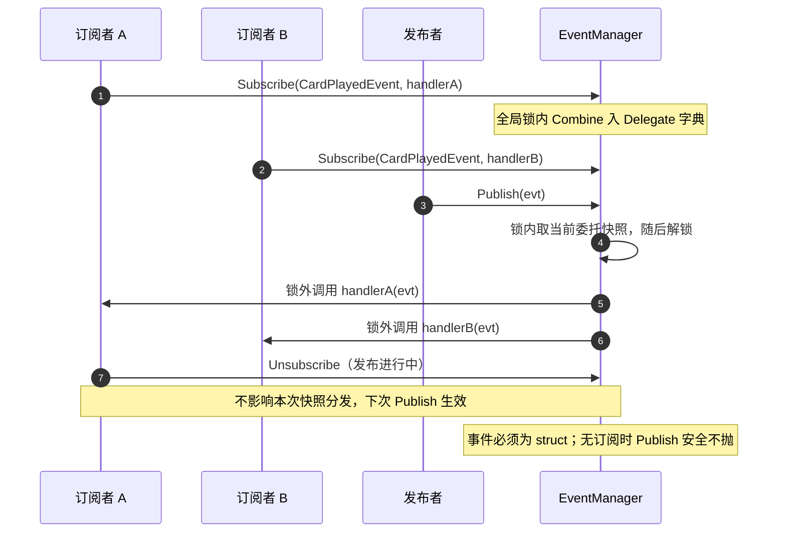

# Events — 强类型事件总线

> 程序集：`RazorFramework.Events`（纯 C#，`noEngineReferences: true`，零引用）
> 位置：`Assets/Plugins/RazorFramework/Events/`
> 状态：✅ 编译域（feat-003 Task 2 完成） · 根目录旧 `Events/` 已删除

## 结构

```text
RazorFramework.Events/
├─ IEventCenter
│  ├─ Subscribe<T>(Action<T>)     where T : struct
│  ├─ Unsubscribe<T>(Action<T>)
│  └─ Publish<T>(T evt)
└─ EventManager : IEventCenter, IDisposable
   ├─ Delegate 字典按事件类型分发（Combine / Remove）
   ├─ 全局锁：订阅/取消线程安全；发布在锁内取快照、锁外调用
   ├─ Publish 无订阅安全（不抛）
   ├─ SubscriptionCount   诊断用订阅类型计数
   └─ Dispose 清空全部订阅
```

*图示：发布/订阅的快照分发（图示辅助，细节以正文为准）*



## 关键决策与不变量

- **D1（已落地）**：`IEventCenter` 不再继承 `IInitializable`，与 Lifecycle 完全解耦；零框架依赖，BCL only。
- 事件必须为 `struct`（编译期约束，杜绝引用类型事件的可变共享）。
- 发布过程中取消订阅不影响本次快照分发。
- 订阅生命周期由消费者管理（订阅/取消配对），框架不自动清理。

## 测试覆盖

```text
RazorFramework.Events.Tests（Editor）
└─ EventManagerTests   订阅 / 多订阅 / 取消 / 空订阅发布 / struct 约束
```

## 已知限制

- 单进程内存总线，无网络/持久化语义。
- 无诊断 sink（区别于 DI），仅 `SubscriptionCount` 计数。
