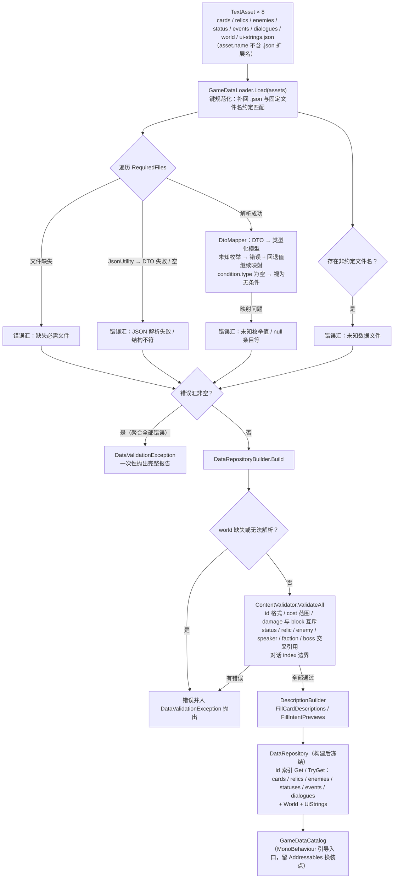

# CardGame — 游戏层与数据契约

> 位置：`Assets/CardGame/` · 状态：✅ 骨架已就位（feat-005）；数据基础已落地（feat-006 in-progress），玩法未开始
> 目标运行时程序集：`CardGame.Runtime`（Unity，refs 框架，feat-003 Task 5 建立）

## 结构

```text
Assets/CardGame/
├─ Scenes/Bootstrap.unity          启动场景（构建列表唯一场景）
├─ Runtime/
│  ├─ CardGame.Domain/    纯 C# 数据模型/DTO 映射/校验/文案生成（noEngineReferences，feat-006）
│  └─ CardGame.Runtime/   Unity 侧 JsonUtility 加载 + GameDataCatalog（refs Domain，feat-006）
├─ Content/Data/          配置数据 JSON（cards/relics/enemies/status/events/dialogues/world/ui-strings）
├─ Settings/
│  ├─ UniversalRP.asset / Renderer2D.asset / DefaultVolumeProfile.asset
│  │  UniversalRenderPipelineGlobalSettings.asset    URP 管线配置
│  ├─ InputSystem_Actions.inputactions               输入资产（生成 PlayerInput 的输入源）
│  └─ Lit2DSceneTemplate.scenetemplate / URP2DSceneTemplate.unity   场景模板
└─ Tests/EditMode/（CardGame.Tests.EditMode，Editor only）
   ├─ ProjectFoundationTests   项目身份 + Bootstrap 构建场景配置
   └─ Data/                    协议测试（枚举/映射/序列化/校验/文案/加载/样例自证）
```

## 数据管线工作原理

*图示：feat-006 数据管线的加载与校验流程（图示辅助，细节以正文与 [CONTRACT.md](../CONTRACT.md) 为准）*



## 数据契约（docs/CONTRACT.md）

> 程序与协作者的共享接口：协作者用 Excel/Markdown 填内容，程序写规则引擎与转换器；
> 数据管线已定案为 Excel → JSON（2026-08-30，见 [09-ui-resources.md](09-ui-resources.md) 数据管线节）。

```text
数据契约
├─ 卡牌系统      CardDef
├─ 效果原语      EffectEntry
├─ 遗物系统      RelicDef
├─ 敌人系统      EnemyDef
├─ 状态系统      StatusDef
├─ 对话系统      DialogueSequence
├─ 叙事事件系统  EventDef
├─ 世界观骨架    WorldDef
├─ 地图层配置    MapLayerDef
├─ UI 文本散表   UIStringsJson
├─ 对话剧本格式  Markdown
├─ 协作流程
└─ 仓库文件结构
```

字段、类型与约束以 `docs/CONTRACT.md` 为唯一契约（现作为 JSON 的 schema 规范）；字段变更必须同步该文档。
存储形态由 ScriptableObject 改为 JSON（2026-08-30 定案，见 [09-ui-resources.md](09-ui-resources.md)）；CONTRACT 的协作流程与文件结构节随数据管线定案更新。

## 关键决策与不变量

- 游戏玩法规则不得进入 RazorFramework（框架只服务通用机制：DI/Events/Lifecycle/Boot）。
- 新增玩法脚本、资源、场景与配置只放在 `Assets/CardGame/` 或明确的子目录。
- 框架与游戏的边界（输入、启动细节）由 feat-003 D5 确定：游戏专属细节一律在 `CardGame.Runtime`。

## 已知限制

- 无玩法实现：卡牌、战斗、地图、叙事、存档、文案均未开始（配置表数据协议已由 feat-006 落地）。
- 场景运行时流程未验证（仅项目身份与构建配置有 EditMode 覆盖）。
- Excel → JSON 转换器未开始（协议先行，转换器为下一功能）。
