# DI 模块源码级讲解（RazorFramework.DI + RazorFramework.Unity.DI）

> 定位：本文回答「DI 模块在**代码层面**是怎么工作的」——逐文件走读每个类做了什么、为什么这样做，并用 CardGame 组合根说明怎么用、怎么扩。
> 配套：设计总览（图 + 语义摘要）见 [01-di.md](01-di.md)；按依赖方向的阅读导航见 [../code-reading-order.md](../code-reading-order.md)；本文件与它们的分工是「01-di 讲设计是什么、code-reading-order 讲先看哪、本文讲源码如何实现」。
> 代码位置：`Assets/Plugins/RazorFramework/DI/`（纯 C# 核心）、`Assets/Plugins/RazorFramework/Unity/DI/`（Unity 适配层）、`Assets/Plugins/RazorFramework/Tests/EditMode/DI/` 与 `.../UnityDI/`（行为背书）。
> 适用读者：想真正读懂或修改 DI 的人。只想用框架写玩法，读第 14 章 + 第 5/7 章的错误语义即可。

---

## 目录

1. [心智模型：两阶段设计与两条主线](#1-心智模型两阶段设计与两条主线)
2. [文件地图与编译边界](#2-文件地图与编译边界)
3. [数据模型：每一条注册从注册期到运行期的形态](#3-数据模型每一条注册从注册期到运行期的形态)
4. [注册期：ContainerBuilder 的 API 落到什么](#4-注册期containerbuilder-的-api-落到什么)
5. [构建期校验：DependencyGraphValidator 五组检查逐组走读](#5-构建期校验dependencygraphvalidator-五组检查逐组走读)
6. [构建期生命周期校验：captive 防护与作用域需求传播](#6-构建期生命周期校验captive-防护与作用域需求传播)
7. [运行期解析：一次 Resolve 的完整旅程](#7-运行期解析一次-resolve-的完整旅程)
8. [作用域层级：创建规则与祖先查找](#8-作用域层级创建规则与祖先查找)
9. [确定性释放：谁拥有谁、按什么顺序释放](#9-确定性释放谁拥有谁按什么顺序释放)
10. [集合注入](#10-集合注入)
11. [错误模型：从异常到定位注册代码](#11-错误模型从异常到定位注册代码)
12. [诊断：观察不改变行为](#12-诊断观察不改变行为)
13. [Unity 适配层：UnityObjectInjector 与 UnityMainThread](#13-unity-适配层unityobjectinjector-与-unitymainthread)
14. [CardGame 实操指南：组合根、新服务、常见错误](#14-cardgame-实操指南组合根新服务常见错误)
15. [关键不变量速查](#15-关键不变量速查)

---

## 1. 心智模型：两阶段设计与两条主线

DI 模块的整体心智模型可以用一句话概括：

> **构建期把所有「如何创建每个服务、它合法活在哪个作用域上下文」一次性算完并冻结；运行期只做查表、构造、记账（归属与释放）。**

整个系统分两个阶段，由 `Build()` 这一行切分：

```text
┌──────────────────────── 构建期（Build 之前） ────────────────────────┐
│ ContainerBuilder          可变注册面：Add* / DefineScope            │
│      │                                                              │
│      ▼                                                              │
│ DependencyGraphValidator   一次性五组校验（第 5、6 章）                │
│      │                                                              │
│      ▼                                                              │
│ ContainerBuildModel        不可变计划：每个服务的构造器 + 依赖清单 +   │
│                            作用域需求，全部预计算（第 3 章）            │
│      │                                                              │
│      ▼                                                              │
│ ServiceContainer           builder 冻结：运行期不得再改注册           │
└──────────────────────────────────────────────────────────────────────┘

┌──────────────────────── 运行期（Build 之后） ────────────────────────┐
│ Resolve / CreateScope       查 DefaultRegistrations/Plans →          │
│                             递归激活 → LifetimeOwner 缓存 + 记账       │
│ ServiceScope 层级           Scoped 锚定声明 scope；子作用域用祖先服务    │
│ Dispose                     逆序释放：依赖者先于被依赖者                 │
└──────────────────────────────────────────────────────────────────────┘
```

对应地，两条贯穿全文的主线是：

- **主线 A（数据）**：一条注册（`ServiceRegistration`）→ 一份激活计划（`ActivationPlan`，含构造器与依赖）→ 运行期一次解析（`ResolveRegistration` 分支出 Singleton/Scoped/Transient）。
- **主线 B（作用域/生命周期）**：`DefineScope` 定义的 scope 树 → 运行期 `ServiceScope` 实例树（同 scope 标记可多实例并存）→ 实例按归属挂在各自 `LifetimeOwner` 上 → 逆序释放。

先看一个"先直觉、后代码"的端到端例子（组合根的真实用法，代码在 `Assets/CardGame/Runtime/CardGame.Runtime/Bootstrap/GameComposition.cs`）：

```csharp
var builder = new ContainerBuilder();
builder.DefineScope<RunScope>();                       // 单局作用域
builder.DefineScope<EncounterScope, RunScope>();       // 遭遇作用域（RunScope 的子）
builder.AddSingleton(data);                            // 外部实例：仓库归调用方所有
builder.AddSingleton<GameFlow>();                      // 构造注入 DataRepository
Container = builder.Build();                           // ← 校验 + 冻结，错误在此全量暴露
Flow = Container.Resolve<GameFlow>();                  // ← 运行期查表激活
```

`Build()` 之前，`builder` 只是一堆"待办条目"的列表；`Build()` 校验它们并产出不可变计划；之后每次 `Resolve` 都只按计划执行，不再有配置逻辑。下文第 4–6 章讲 `Build()` 内部，第 7–9 章讲运行期。

---

## 2. 文件地图与编译边界

### 2.1 程序集

| 程序集 | 目录 | 引用 | `noEngineReferences` | 角色 |
|---|---|---|---|---|
| `RazorFramework.DI` | `DI/` | 无 | `true`（纯 C#，BCL only） | DI 核心 |
| `RazorFramework.Unity.DI` | `Unity/DI/` | `RazorFramework.DI` | 未设（可触 UnityEngine） | Unity 对象注入适配层，`autoReferenced: false` |

`noEngineReferences: true` 由 asmdef 强制，Harness 还做 token 级检查：`DI/` 下任何 `.cs` 不得出现 `UnityEngine` 记号。**依赖方向单向**：核心不知道 Unity 存在，适配层引用核心。

*图示：程序集依赖方向与门禁。实线 = 编译期引用（箭头指向被引用方）；虚线 = Harness 门禁检查。核心（DI）不知道 Unity 存在。*

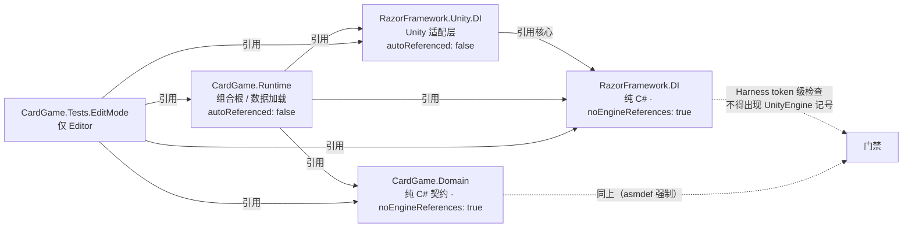

### 2.2 核心文件与各自职责

| 文件 | 可见性 | 一句话职责 |
|---|---|---|
| `Abstractions.cs` | public | 公共契约：`ServiceLifetime` 枚举、`IServiceResolver`、`ContainerOptions`、`[InjectConstructor]` |
| `ContainerBuilder.cs` | public | 注册面（可变阶段）；`Build()` 后 `_consumed = true` 冻结 |
| `ServiceRegistration.cs` | internal | 一条注册的不可变记录 + `ScopeDefinition`（scope 父子定义） |
| `ActivationPlan.cs` | internal | 激活计划三件套：`DependencyPlan` / `ActivationPlan` / `ContainerBuildModel`（构建产物） |
| `DependencyGraphValidator.cs` | internal static | 构建期五组校验，产出 `ContainerBuildModel` |
| `ServiceContainer.cs` | public | 根容器：解析入口、scope 创建、整体释放、运行时错误路径 |
| `ServiceScope.cs` | public | 子作用域：委托容器解析、子 scope 管理、自身释放 |
| `LifetimeOwner.cs` | internal | 实例缓存（`Lazy`）与归属清单；`DisposalExceptionCollector` 聚合释放错误 |
| `Diagnostics.cs` | public + internal | 诊断事件与 `DiagnosticDispatcher`（观察性，吞异常） |
| `DependencyInjectionException.cs` | public | 结构化异常：Code + 类型三件套 + `DependencyPath` 类型链 |

> 公共面很小：外部只看到 `ContainerBuilder / ServiceContainer / ServiceScope / IServiceResolver / 三种 Attribute / 异常与诊断`。其余全部 `internal`——这是刻意设计：**可变计划、构造细节、归属机制都不暴露**，防止使用方绕过构建期校验。

### 2.3 测试文件 = 行为契约

每个测试文件对应一组语义，讲行为时文内会挂测试名：

| 测试文件 | 背书内容 |
|---|---|
| `BuilderValidationTests.cs` | 重复注册 / 缺失依赖 / 间接环 / 构造器选择 / 抽象实现 / builder 消耗语义 |
| `HierarchicalScopeTests.cs` | 层级共享 / 直接父校验 / 越权解析 / Transient 捕获 / 兄弟 scope / scope 定义校验 |
| `ResolutionLifetimeTests.cs` | Singleton / Transient / Scoped 解析语义、外部实例、TryResolve 不吞激活失败 |
| `OwnershipAndConcurrencyTests.cs` | 释放顺序 / 外部实例不释放 / Transient 归属 / 聚合错误 / 幂等 / 并发只构造一次 |
| `CollectionAndDiagnosticsTests.cs` | 集合顺序 / 空集合 / 集合生命周期 / 集合 captive / 诊断事件 / sink 异常隔离 |

---

## 3. 数据模型：每一条注册从注册期到运行期的形态

*图示：主线 A —— 一条注册从「注册期 → 构建期 → 运行期」的三形态。同一份逻辑在三处有不同载体：可变条目、不可变计划、运行期查表。*

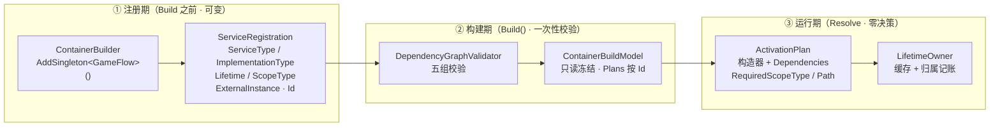

### 3.1 注册期：`ServiceRegistration`

`ContainerBuilder` 每次 `Add*` 都生成一条**不可变**的 `ServiceRegistration`（`internal sealed`），先看字段：

```csharp
internal sealed class ServiceRegistration
{
    public int Id { get; }                 // builder 内自增序号，全程唯一
    public Type ServiceType { get; }       // 对外暴露的类型（接口 / 抽象基类 / 自身）
    public Type ImplementationType { get; }// 实际构造的类型；外部实例为 null
    public ServiceLifetime Lifetime { get; }// Singleton / Scoped / Transient
    public Type ScopeType { get; }         // Scoped 专属：锚定的 scope 标记
    public object ExternalInstance { get; }// 外部实例注册专属
    public bool IsCollection { get; }      // 是否集合条目（AddCollection*）
    public bool IsExternal => ImplementationType == null;  // 外部实例注册的判别
}
```

要点：

- **`Id` 是实例缓存的键**（见 `LifetimeOwner` 的 `Dictionary<int, Lazy<object>>`）。同一 `Id` 对应同一条注册，因此"Singleton 全体共享一份、Scoped 每 scope 一份"都用同一个 `Id` 在不同 owner 的字典里查。
- **`IsExternal` 与 `IsCollection` 是形状，不是生命周期**：外部实例固定 `Singleton`；集合条目可以是三种生命周期之一（`AddCollectionSingleton / Transient / Scoped`）。
- **默认服务与集合条目互斥注册空间**：一条注册要么服务类型可被默认解析（`Resolve<T>`），要么成为 `ResolveAll<T>` 的一个条目——不能两者皆占。这由第 5.2 节的两个字典构建区分。

### 3.2 scope 定义：`ScopeDefinition`

```csharp
internal readonly struct ScopeDefinition
{
    public Type ScopeType { get; }        // 本 scope 标记（例如 RunScope）
    public Type ParentScopeType { get; }  // 父 scope 标记（可为 null = 根 scope）
}
```

**scope 标记只是空 class**（如 `GameComposition` 里的 `RunScope {}`）。DI 不实例化它，只用 `Type` 当树节点键。一个标记类型在构建期出现于 `scopeParents` 字典（`scopeType → parentScopeType`），在运行期可对应**多个** `ServiceScope` 实例（两局 Run 并存时有两个 `RunScope` 标记的 scope 实例）。

### 3.3 构建期产物：`ContainerBuildModel`

`Build()` 校验通过后产出不可变 `ContainerBuildModel`，它是运行期的全部依据：

```csharp
internal sealed class ContainerBuildModel
{
    public IReadOnlyList<ServiceRegistration> Registrations { get; }                 // 全部注册（保序）
    public IReadOnlyDictionary<Type, ServiceRegistration> DefaultRegistrations { get; } // 默认服务：ServiceType → 注册
    public IReadOnlyDictionary<Type, IReadOnlyList<ServiceRegistration>> CollectionRegistrations { get; } // 集合：ServiceType → 条目列表（注册序）
    public IReadOnlyDictionary<int, ActivationPlan> Plans { get; }                   // Id → 激活计划
    public IReadOnlyDictionary<Type, Type> ScopeParents { get; }                     // scopeType → parentScopeType
}
```

四个字典 + 一个列表就是运行期的全部只读知识：

- 解析 `T` → `DefaultRegistrations[T]` → 按 `Plans[Id]` 激活。
- 解析 `ResolveAll<T>` → `CollectionRegistrations[T]`（缺省 = 空数组）。
- `CreateScope<X>()` → 查 `ScopeParents` 校验父子关系是否合法。
- 运行时 mismatch / 越权错误所需的 `RequiredScopeType/Path` 已预存在 `ActivationPlan` 上（第 6 章）。

### 3.4 激活计划：`ActivationPlan` 与 `DependencyPlan`

```csharp
internal sealed class ActivationPlan
{
    public ServiceRegistration Registration { get; }
    public ConstructorInfo Constructor { get; }              // 构建期选定的唯一构造器
    public IReadOnlyList<DependencyPlan> Dependencies { get; }// 构造参数计划（顺序 = 参数顺序）
    public Type RequiredScopeType { get; set; }              // ↓ 生命周期校验后回填（第 6 章）
    public IReadOnlyList<Type> RequiredScopePath { get; set; }
}

internal readonly struct DependencyPlan
{
    public Type ParameterType { get; }   // 参数声明类型（可能是 IReadOnlyList<X>）
    public Type ServiceType { get; }     // 实际要解析的服务类型（集合时为元素类型 X）
    public bool IsCollection { get; }    // 参数是 IReadOnlyList<> 吗
}
```

**这是"构建期把活干完"理念的核心载体**：反射选构造器、构造参数依赖识别、作用域需求合并全部在 `Build()` 内完成一次；运行期 `Resolve` 只遍历 `Dependencies` 逐个查字典。运行期不再做任何"决定"（没有注册查找顺序问题、没有构造器歧义），只有执行与失败报告。

### 3.5 运行期角色：`ServiceContainer` / `ServiceScope` / `LifetimeOwner`

把模型"落地"成可解析、可释放的运行时对象，需要三类实例：

```text
ServiceContainer（根）
├─ _model        构建期产物（只读）
├─ _rootOwner    根 LifetimeOwner —— Singleton 实例都挂这里
├─ _rootScopes   根 ServiceScope 列表（ScopeType 无父的 scope 实例）
└─ _disposed     容器整体释放标记
        │
        ▼ 按 DefineScope 定义实例化
ServiceScope（每个 scope 实例）
├─ _container    回指根容器（解析都委托给它）
├─ Parent        父 scope 实例（null = 根 scope）
├─ ScopeType     本实例的 scope 标记类型
├─ Owner         本 scope 的 LifetimeOwner —— Scoped 锚定此 scope 的实例、解析于此的 Transient 都挂这里
└─ _children     子 scope 实例列表

LifetimeOwner（每容器一个 + 每 scope 一个）
├─ _instances    Dictionary<int, Lazy<object>>：Id → 惰性单例槽（Singleton/Scoped 用）
├─ _ownedInstances List<IDisposable>：实际被本 owner 释放的实例（含 Transient）
└─ _disposed
```

**LifetimeOwner 是本模块对"确定性所有权"的答案**：每个容器/作用域自带一个 owner，owner 只负责两类事——(a) 用 `Lazy` 保证同一 `Id` 只构造一次；(b) 把构造出来的、自己**拥有**的 `IDisposable` 记入清单，释放时逆序调用。

> 为什么一个 scope 实例需要自己的 owner 而不是直接 `Dictionary`？因为释放必须是"清单驱动"的：实例可能在任意时序被解析（先 A 后 B），释放时必须按**创建顺序逆序**，且只释放本 owner 内创建的。owner 把"缓存"与"归属清单"合并成一个有明确纪律的组件。

---

## 4. 注册期：ContainerBuilder 的 API 落到什么

`ContainerBuilder` 全文只有 `Add*` / `DefineScope` / `Build` 三类方法，全部落到 `AddType` 一个私有方法或直接 new `ServiceRegistration`：

```csharp
private ContainerBuilder AddType(
    Type serviceType, Type implementationType, ServiceLifetime lifetime,
    Type scopeType, bool isCollection = false)
{
    EnsureMutable();
    _registrations.Add(new ServiceRegistration(
        _nextRegistrationId++, serviceType, implementationType,
        lifetime, scopeType, null, isCollection));
    return this;
}
```

各 public API 与落点的对照：

| API | 生成字段 | 备注 |
|---|---|---|
| `AddSingleton<TService,TImpl>()` | `lifetime=Singleton, isCollection=false` | 走 `AddType` |
| `AddSingleton<TImpl>()` | 同上，service=impl | 便捷重载：`AddSingleton<T,T>()` |
| `AddSingleton<T>(instance)` | `implementationType=null, externalInstance=instance` | **外部实例**：`IsExternal=true`，不走 `AddType` |
| `AddTransient<...>` | `lifetime=Transient` | 同构 |
| `AddScoped<TService,TImpl,TScope>()` | `lifetime=Scoped, scopeType=typeof(TScope)` | 泛型 `<TImplementation, TScope>` 变体同理 |
| `AddCollection{Singleton\|Transient\|Scoped}` | `isCollection=true` | 成为集合条目 |
| `DefineScope<T>()` / `DefineScope<T,TParent>()` | 追加 `ScopeDefinition` | 父为 null 或显式父标记 |

三个必须记住的纪律（测试背书）：

1. **`EnsureMutable()` 守卫一切**：`Build()` 成功后 `_consumed = true`，之后再 `Add*` 或 `Build()` 抛 `InvalidOperationException`（`SuccessfulBuild_ConsumesBuilder`）。
2. **失败不消耗**：`_consumed` 只在 `Build()` 成功返回后置位；校验抛异常时 builder 原样可用，补上缺失注册可再 `Build()`（`FailedBuild_DoesNotConsumeBuilder`）。
3. **构建是快照**：`Build()` 把 `_registrations` / `_scopeDefinitions` 传给 validator，validator 内部 `ToArray()` 复制；builder 不再持有后续状态。

> 设计动机：**注册表必须冻结**。若运行期能改注册，`ServiceContainer` 的所有只读假设（字典无重复、计划完备、captive 已查）都会失效。冻结是让"构建期校验一次、运行期零决策"成立的前提。

---

*图示：builder 状态机（§4 三个纪律）。只有 Build() 全部校验通过才冻结；失败不消耗 builder，补注册后可重试。*

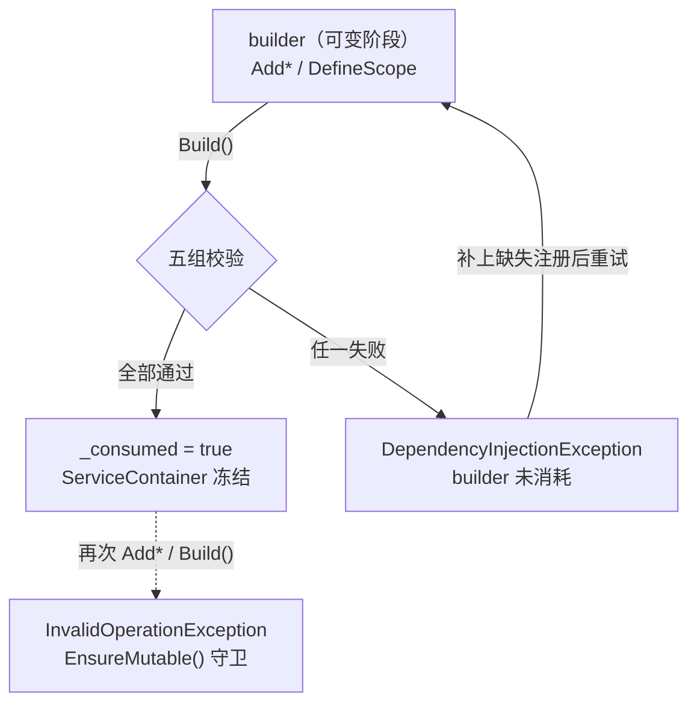

## 5. 构建期校验：DependencyGraphValidator 五组检查逐组走读

`DependencyGraphValidator.Build` 是纯静态入口，串行执行五步（每步失败即抛结构化 `DependencyInjectionException`，见第 11 章）：

```csharp
public static ContainerBuildModel Build(
    IReadOnlyList<ServiceRegistration> sourceRegistrations,
    IReadOnlyList<ScopeDefinition> sourceScopeDefinitions)
{
    var registrations = sourceRegistrations.ToArray();
    var defaultRegistrations = BuildDefaultRegistrations(registrations);   // ① 默认注册唯一性
    var collectionRegistrations = BuildCollectionRegistrations(registrations);// ② 集合分组
    var scopeParents = BuildScopeTree(sourceScopeDefinitions);              // ③ scope 树
    var plans = BuildActivationPlans(registrations, scopeParents);          // ④ 激活计划 + 构造器
    ValidateDependencyGraph(...);   // ⑤-a 依赖图 DFS：缺失 / 环
    ValidateLifetimes(...);         // ⑤-b 生命周期（第 6 章专讲）

    return new ContainerBuildModel(...);
}
```

*图示：Build() 五组校验流水线（① → ⑤-b 串行；任一步失败即抛结构化异常并终止，不再继续后续步骤）。*

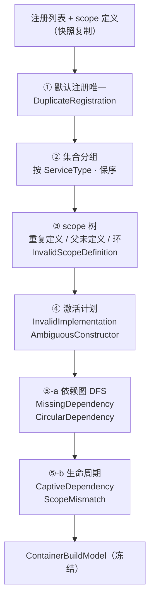

### 5.1 ① 默认注册唯一 → `DuplicateRegistration`

```csharp
foreach (var registration in registrations)
{
    if (registration.IsCollection) continue;         // 集合条目不占默认注册位
    if (result.ContainsKey(registration.ServiceType))
        throw Error(DuplicateRegistration, "...", registration.ServiceType, ...);
    result.Add(registration.ServiceType, registration);
}
```

- 只对**默认注册**（非集合）判重：同一 `ServiceType` 只能注册一次，否则 `Resolve<T>` 无从选择（`Build_RejectsDuplicateDefaultRegistration`）。
- 集合条目不判重——同类型可以有多条集合条目（见第 10 章）。

### 5.2 ② 集合分组（无错误路径）

把 `IsCollection` 的注册按 `ServiceType` 分组、**保持注册顺序**存入 `CollectionRegistrations`。这决定了 `ResolveAll<T>` 的元素顺序 = 代码注册顺序（`Collection_UsesOnlyExplicitEntriesInRegistrationOrder` 背书）。

### 5.3 ③ scope 树 → `InvalidScopeDefinition`

`BuildScopeTree` 三步：

1. **重复定义检查**：同一 `ScopeType` 只允许 `DefineScope` 一次（`Build_RejectsDuplicateScopeDefinition`）。
2. **父必须已定义**：`ParentScopeType != null` 时父标记必须在表中（否则 `InvalidScopeDefinition`）。
3. **环检测**：从每个标记沿父链上溯，`HashSet<Type>` 见重复即环（`Build_RejectsScopeDefinitionCycle`，例如 `RunTag→EncounterTag`、`EncounterTag→RunTag` 互相为父）。

产物：`Dictionary<Type, Type> scopeParents`——运行期 `CreateScope` 的父子合法性、第 6 章 `IsAncestorOrSame` 的祖先判定都查它。注意此表是**标记 → 标记**的关系，与运行期 scope 实例无关。

### 5.4 ④ 激活计划：实现合法性 + 构造器选择

`BuildActivationPlans` 对每条非外部注册依次检查：

**(a) 实现类型必须"具体封闭且可赋值" → `InvalidImplementation`**

```csharp
if (!registration.ServiceType.IsAssignableFrom(implementationType) ||
    implementationType.IsAbstract || implementationType.IsInterface ||
    implementationType.ContainsGenericParameters)
    throw Error(InvalidImplementation, "...", ...);
```

即：实现必须是**已闭合的具体类**，且可赋值给服务类型。抽象/接口实现（`Build_RejectsAbstractImplementation`）、开放泛型都拒绝。外部实例的独立检查是**实例非 null**（`ExternalInstance == null` → `InvalidImplementation`）。

**(b) Scoped 必须挂已定义 scope → `InvalidScopeDefinition`**

`lifetime == Scoped` 且 `ScopeType == null` 或标记未定义 → 抛。这是编译期类型约束（`AddScoped<...,TScope>`）之外的运行期兜底。

**(c) 构造器选择 → `AmbiguousConstructor`**

```csharp
var allConstructors = implementationType.GetConstructors(Instance|Public|NonPublic);
var markedNonPublic = allConstructors.Any(c => !c.IsPublic && c.IsDefined(typeof(InjectConstructorAttribute), false));
var publicConstructors = implementationType.GetConstructors(Instance|Public);
var markedPublic = publicConstructors.Where(c => c.IsDefined(typeof(InjectConstructorAttribute), false)).ToArray();

if (markedNonPublic || publicConstructors.Length == 0 ||
    markedPublic.Length > 1 ||
    (publicConstructors.Length > 1 && markedPublic.Length != 1))
    throw Error(AmbiguousConstructor, ...);

return markedPublic.Length == 1 ? markedPublic[0] : publicConstructors[0];
```

规则可归纳为一张表：

| public 构造器情况 | `[InjectConstructor]` | 结果 |
|---|---|---|
| 0 个 | 无 | 拒绝（`AmbiguousConstructor`） |
| 恰 1 个 | 任意 | 用这一个（标记与否都行） |
| ≥2 个 | 0 个 | 拒绝（歧义） |
| ≥2 个 | 恰 1 个 public | 用标记的那个 |
| 任意 | ≥2 个 public | 拒绝 |
| 任意 | 任何非 public 带标记 | 拒绝（`markedNonPublic`） |

测试背书：`Build_UsesTheSingleMarkedPublicConstructor`（两个构造器、标一个 → 用标记的）、`Build_RejectsUnmarkedAmbiguousConstructors`、`Build_RejectsMultipleMarkedConstructors`、`Build_RejectsMarkedPrivateConstructor`。

**(d) 依赖计划 → 识别 `IReadOnlyList<>` 为集合**

```csharp
private static DependencyPlan BuildDependencyPlan(Type parameterType)
{
    if (parameterType.IsGenericType &&
        parameterType.GetGenericTypeDefinition() == typeof(IReadOnlyList<>))
        return new DependencyPlan(parameterType, parameterType.GetGenericArguments()[0], true);
    return new DependencyPlan(parameterType, parameterType, false);  // 普通依赖：参数类型即服务类型
}
```

这是集合注入的识别点：**构造参数只要声明 `IReadOnlyList<X>` 就视为"注入 X 的集合"**，运行期走 `ResolveCollection`（第 10 章）。

### 5.5 ⑤-a 依赖图 DFS：缺失依赖与环

`ValidateDependencyGraph` 对每条注册做一次独立 DFS（`Visit`），用 `Dictionary<int, VisitState>` 标记 Visiting/Visited：

- **`MissingDependency`**：某依赖类型的 `DefaultRegistrations` 查不到（且非集合、集合又无条目）→ 抛，路径 = 当前实现链 + 缺失类型。
- **`CircularDependency`**：DFS 撞上 Visiting 状态 → 环，路径 = 当前链 + 回到环起点类型。

```csharp
private static void Visit(ServiceRegistration registration, ...)
{
    if (states.TryGetValue(registration.Id, out var state))
    {
        if (state == VisitState.Visiting)
        {
            var cyclePath = new List<Type>(path) { registration.ImplementationType ?? registration.ServiceType };
            throw Error(CircularDependency, "...", ..., cyclePath);
        }
        return;   // 已 Visited：共享子树，不必重走
    }
    states[registration.Id] = VisitState.Visiting;
    path.Add(...);
    foreach (var dependencyPlan in plans[registration.Id].Dependencies)
    {
        if (dependencyPlan.IsCollection) { ... 遍历 entries 递归 ... continue; }
        if (!defaults.TryGetValue(dependencyPlan.ServiceType, out var dependency))
            throw Error(MissingDependency, "...", ..., path + dependencyPlan.ServiceType);
        Visit(dependency, ...);
    }
    path.RemoveAt(path.Count - 1);
    states[registration.Id] = VisitState.Visited;
}
```

注意三个细节：

- **集合依赖也参与图遍历**：集合条目的环/缺失同样被抓（集合内条目互相依赖、或条目依赖集合消费者等）。
- **访问未注册的集合 = 合法**：依赖 `IReadOnlyList<X>` 而 X 无集合注册时**不**报缺失——运行期注入空数组（第 10 章 `MissingCollection_ResolvesAndInjectsAsEmptyReadOnlyList`）。只有"默认服务类型缺失"才报 `MissingDependency`。
- 测试背书：`Build_RejectsMissingConstructorDependency`（路径 `[NeedsMissingDependency, IMissingDependency]`）、`Build_RejectsIndirectCycle`（首尾都是 `CycleA`，证明是间接环 A→B→A）。

### 5.6 ⑤-b 生命周期校验

见下一章——它是本模块最值得细读的部分。

---

## 6. 构建期生命周期校验：captive 防护与作用域需求传播

### 6.1 问题：为什么需要它

肉鸽游戏最经典的 bug 是**跨作用域捕获**：Singleton 里持有了某一局的状态对象，第二局开始时 Singleton 还拿着第一局的对象 → "新的一局带着上一局的状态"。这类 bug 传统上要玩到第二局才暴露。`ValidateLifetimes` 的目标是把这类错误**提前到 `Build()` 一次性拦截**。

它做两件事：
1. 对每条注册（含经 Transient、集合传递的间接依赖）算出"激活它需要哪个 scope 在场"——即 `RequiredScopeType` 与 `RequiredScopePath`；
2. 沿依赖图自底向上合并，凡出现以下三种违规立即抛错。

*图示：§6.4 的间接捕获示例。Scoped 叶子先产生需求，需求沿 Transient 逐层上溯并延长路径，最终在 Singleton 处被截获 → Build() 即抛。*

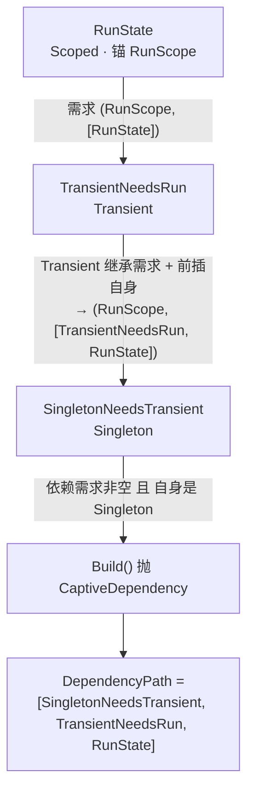

### 6.2 核心递归：`DetermineRequiredScope`

```csharp
private static ScopeRequirement DetermineRequiredScope(ServiceRegistration registration, ...)
{
    if (registration.IsExternal) return null;               // 外部实例无需求
    if (requirements.TryGetValue(registration.Id, out var cached)) return cached;  // 记忆化（依赖图共享子树只算一次）

    ScopeRequirement dependencyRequirement = null;
    var plan = plans[registration.Id];
    foreach (var dependencyPlan in plan.Dependencies)
    {
        // 集合依赖：逐条目合并
        if (dependencyPlan.IsCollection)
        {
            foreach (var entry in collections[dependencyPlan.ServiceType])
                dependencyRequirement = MergeDependencyRequirement(dependencyRequirement, entry, ...);
            continue;
        }
        dependencyRequirement = MergeDependencyRequirement(
            dependencyRequirement, defaults[dependencyPlan.ServiceType], ...);
    }

    ScopeRequirement result;
    switch (registration.Lifetime)
    {
        case Singleton:
            if (dependencyRequirement != null)
                throw Error(CaptiveDependency, "A singleton cannot capture a scoped dependency.", ..., PrefixPath(registration, dependencyRequirement.Path));
            result = null;   // Singleton 无作用域需求
            break;
        case Scoped:
            if (dependencyRequirement != null &&
                !IsAncestorOrSame(dependencyRequirement.ScopeType, registration.ScopeType, scopeParents))
                throw Error(CaptiveDependency, "A scoped service cannot depend on a descendant scope.", ...);
            result = new ScopeRequirement(registration.ScopeType, new[] { implementationType ?? serviceType });
            break;
        case Transient:
            result = dependencyRequirement == null ? null
                : new ScopeRequirement(dependencyRequirement.ScopeType,
                    PrefixPath(registration, dependencyRequirement.Path));  // 继承依赖的需求并延长路径
            break;
    }
    plan.RequiredScopeType = result?.ScopeType;   // ← 回填到激活计划，运行期使用
    plan.RequiredScopePath = result?.Path;
    requirements[registration.Id] = result;
    return result;
}
```

递归方向：**从叶子（无依赖的服务）向根传播**。`requirements` 字典做记忆化，保证每个 `Id` 只算一次——这是整个算法避免指数爆炸的关键。

每个 `ScopeRequirement` 携带 `ScopeType`（需要哪个 scope 在场）和 `Path`（类型链，用于报错定位）。三种生命周期的语义：

| 生命周期 | 自身需求 | 依赖需求处理 | 结果 |
|---|---|---|---|
| `Singleton` | 无 | 依赖有需求 → **抛 `CaptiveDependency`** | `null` |
| `Scoped` | `自身 scopeType` | 依赖需求是自身 scope 的**祖先/相同**（不深于自己）→ 合法；依赖需求是**后代**（更深）→ **抛 `CaptiveDependency`** | `自身 scopeType` |
| `Transient` | 无 | 直接继承依赖需求（路径前插自身类型） | 依赖的 `ScopeType` 或 `null` |

直觉解释：

- **Singleton 不许碰任何 Scoped/Transient(→Scoped) 依赖**——单例活在根，根之外的对象都属于某个作用域，持有它 = 捕获（无论隔了多少层 Transient，第 6.4 节证明照样能抓到）。
- **Scoped 可以依赖自己或祖先 scope 的 Scoped 服务**（Encounter 服务注入 Run 状态合法：Encounter 活着时 Run 必活着）；**依赖后代 scope 的服务 = 反向捕获**（Run 服务注入 Encounter 状态：Encounter 没了 Run 服务还活着），同样 `CaptiveDependency`（`Build_RejectsParentScopedServiceDependingOnChildScope`）。
- **Transient 是"需求搬运工"**：自身无锚，但它把依赖的需求原样继承（含 `RequiredScopePath` 前插自身类型）。这解释了为什么"Singleton → Transient → Scoped"的链条能在 `Build()` 被抓（下一节示例）。

### 6.3 合并两条需求链：`MergeRequirements`

一个服务有多个依赖、每个依赖各有作用域需求时，需要合并成一条：

```csharp
private static ScopeRequirement MergeRequirements(left, right, registration, scopeParents)
{
    if (left == null) return right;
    if (right == null) return left;
    if (IsAncestorOrSame(left.ScopeType, right.ScopeType, scopeParents)) return right;  // right 在 left 子树内 → 取更深的 right
    if (IsAncestorOrSame(right.ScopeType, left.ScopeType, scopeParents)) return left;   // 反之取 left
    throw Error(ScopeMismatch, "A service requires incompatible sibling scopes.", ...,
                MergeConflictPath(registration, left.Path, right.Path));  // 兄弟：无共同祖先，无法并存
}
```

`IsAncestorOrSame(ancestor, descendant)` 沿 `scopeParents` 从 `descendant` 上溯查 `ancestor`。

**合并规则 = 取两者中较深的那个**：若需求 A 要求 `RunScope` 在场、需求 B 要求 `EncounterScope`（Run 的后代）在场，则只要 `EncounterScope` 在场，两个需求都满足（Encounter 里能解析 Run 锚定的服务）。所以合并结果收敛到"共同可满足的最深 scope"。这与运行期 `FindAncestor` 语义完全一致（第 8 章）。

**不可合并 = 兄弟 scope 冲突**：两个需求 scope 互不为祖先（如 Battle 与 Shop 是兄弟），任何单一活动 scope 都无法同时满足 → `Build()` 即抛 `ScopeMismatch`（`Build_RejectsServiceRequiringSiblingScopes` 路径 `[NeedsBattleAndShop, BattleState, ShopState]`）。

### 6.4 一条路径抓到间接捕获：验证直觉

测试 `Build_RejectsSingletonCapturingRunScopeThroughTransient` 是最佳示例：

```text
注册：AddScoped<RunState, RunTag>
      AddTransient<TransientNeedsRun>          // ctor(RunState)
      AddSingleton<SingletonNeedsTransient>    // ctor(TransientNeedsRun)
结果：Build() 抛 CaptiveDependency
路径：DependencyPath = [SingletonNeedsTransient, TransientNeedsRun, RunState]
```

递归过程：

1. `DetermineRequiredScope(RunState 注册)`：无依赖 → Scoped 需求 = `(RunTag, [RunState])`。
2. `DetermineRequiredScope(TransientNeedsRun)`：依赖 RunState → Transient 继承需求 = `(RunTag, [TransientNeedsRun, RunState])`（路径前插自身）。
3. `DetermineRequiredScope(SingletonNeedsTransient)`：依赖 TransientNeedsRun → 自身是 Singleton 而依赖需求非空 → **抛 `CaptiveDependency`**，路径 = `PrefixPath(SingletonNeedsTransient, [TransientNeedsRun, RunState])` = `[SingletonNeedsTransient, TransientNeedsRun, RunState]`。

**这就是"把第 2 局 bug 提前到 Build()"的实现机制**：依赖需求沿 Transient 逐层向上传播并延长路径，任何一级 Singleton 截获到非空需求即报错，路径完整呈现"Singleton → … → 哪个 Scoped 服务"。

集合同理：`SingletonConsumer_CannotCaptureScopedCollection` 证明依赖 `IReadOnlyList<Scoped条目>` 的 Singleton 也被拦（6.2 循环里对集合逐条目合并需求）。

### 6.5 需求如何传到运行期

`DetermineRequiredScope` 把结果写入 `plan.RequiredScopeType / RequiredScopePath`（`ActivationPlan` 上的可回填字段）。运行期 `ResolveRegistration` 第一件事就是检查它（第 7.3 节）：

```csharp
var requiredScope = plan.RequiredScopeType;
if (requiredScope != null && (scope == null || scope.FindAncestor(requiredScope) == null))
    throw ScopeMismatch(..., BuildDependencyPath(path, plan.RequiredScopePath));
```

所以**运行期 mismatch 不需要再分析依赖图**，只要"当前解析上下文里有没有要求的 scope 在场"——需求的类型链（`RequiredScopePath`）还是从构建期原样带下来的。例如 `container.Resolve<RunState>()`（根解析 Scoped）在构建期合法（图本身没环），但运行期发现要求的 `RunTag` 不在场 → `ScopeMismatch`，路径 `[RunState]`（`Resolve_RejectsScopedServiceOutsideRequiredScope`）。

---

## 7. 运行期解析：一次 Resolve 的完整旅程

### 7.1 全景时序

先看一张 sequence 图建立直觉。场景取自测试语义（`TransientNeedsRun` 构造注入 `RunState`，`RunState` 是 `RunScope` 锚定的 Scoped 服务）：在 **Encounter scope** 里解析这个 Transient 服务，它需要到祖先 Run scope 里取 Run 级实例。此图是一条真实解析路径的线性时序，细节在 7.2–7.6 逐段展开：

```mermaid
sequenceDiagram
    autonumber
    participant Caller as "调用方"
    participant Enc as "ServiceScope (Encounter)"
    participant Cont as "ServiceContainer"
    participant Run as "ServiceScope (Run)"
    participant OwnE as "LifetimeOwner (Enc)"
    participant OwnR as "LifetimeOwner (Run)"

    Caller->>Enc: Resolve&lt;TransientNeedsRun&gt;()
    Enc->>Enc: lock(_lifecycleGate) + EnsureNotDisposed
    Enc->>Cont: ResolveFromScope(this, TransientNeedsRun)
    Cont->>Cont: 容器 EnsureNotDisposed + 查 DefaultRegistrations<br/>（缺 → MissingDependency）
    Cont->>Cont: ResolveRegistration(reg, scope=Enc)
    Note over Cont: 预检 RequiredScopeType=RunTag<br/>Enc.FindAncestor(RunTag) 命中 → 放行
    Cont->>OwnE: Transient 分支 → Enc.Owner.CreateTransient(factory)
    Cont->>Cont: CreateInstance：解析构造参数 RunState<br/>→ Scoped 分支：Enc.FindAncestor(RunTag)
    Cont->>Run: 命中祖先 Run 实例
    Cont->>OwnR: Run.Owner.GetOrCreate(RunStateId)<br/>（缓存命中或 Lazy 首次构造）
    OwnR-->>Cont: RunState 实例
    Cont->>Cont: Constructor.Invoke → TransientNeedsRun<br/>+ InstanceCreated 诊断
    Cont-->>Enc: 实例
    Enc-->>Caller: 返回
```

### 7.2 入口：`ServiceScope` 的锁与委托

`ServiceScope` 的每个 public 方法结构一致——**先拿本 scope 的 `_lifecycleGate` 锁，再 `EnsureNotDisposed`，然后委托给容器**：

```csharp
public T Resolve<T>() where T : class => (T)Resolve(typeof(T));

public object Resolve(Type serviceType)
{
    lock (_lifecycleGate)
    {
        EnsureNotDisposed();
        return _container.ResolveFromScope(this, serviceType);
    }
}
```

同类：`TryResolve`（未注册返回 false 而不抛）、`ResolveAll<T>`、`CreateScope<TScope>()`。要点：

- **scope 级并发串行化**：同一 scope 的解析/建子 scope/释放互斥，但不同 scope 可并行（各自锁独立）。
- **`EnsureNotDisposed`**：scope 已释放 → 抛 `ContainerDisposed`（复用容器错误码；`DisposedScope_RejectsResolutionAndChildCreation` 背书——已释放 scope 再 Resolve 或 CreateScope 都拒）。
- 真正的解析逻辑**全在容器**（`ResolveFromScope` → `ResolveForScope`），scope 只是"解析上下文 + 归属主体"。

### 7.3 容器分派：`ResolveRegistration` 四分支

`ServiceContainer.ResolveForScope` 先做三件事：`EnsureNotDisposed`（容器释放检查，锁容器 gate）、null 检查、`DefaultRegistrations` 查表（缺 → `MissingDependency`，路径 `[serviceType]`），然后进入 `ResolveRegistration(registration, scope, path)`——**运行期的心跳函数**：

```csharp
private object ResolveRegistration(ServiceRegistration registration, ServiceScope scope, IList<Type> path)
{
    if (registration.IsExternal)
        return registration.ExternalInstance;      // 分支 0：外部实例，原样返回，不构造不归属

    var plan = _model.Plans[registration.Id];
    var requiredScope = plan.RequiredScopeType;
    if (requiredScope != null && (scope == null || scope.FindAncestor(requiredScope) == null))
        throw ScopeMismatch(..., BuildDependencyPath(path, plan.RequiredScopePath));  // 分支 0.5：作用域预检

    switch (registration.Lifetime)
    {
        case ServiceLifetime.Singleton:
            return _rootOwner.GetOrCreate(registration.Id,
                () => CreateInstance(registration, null, path));      // 分支 1：根 owner
        case ServiceLifetime.Transient:
            var transientOwner = scope?.Owner ?? _rootOwner;
            return transientOwner.CreateTransient(
                () => CreateInstance(registration, scope, path));     // 分支 2：解析处 owner
        case ServiceLifetime.Scoped:
            var anchor = scope?.FindAncestor(registration.ScopeType); // 分支 3：锚定声明 scope
            if (anchor == null) throw ScopeMismatch(...);
            return anchor.Owner.GetOrCreate(registration.Id,
                () => CreateInstance(registration, anchor, path));
        default:
            throw new ArgumentOutOfRangeException();
    }
}
```

*图示：ResolveRegistration 的运行期分派决策树（分支号与正文逐条对应）。外部实例（分支 0）不经过任何构造、缓存与归属。*

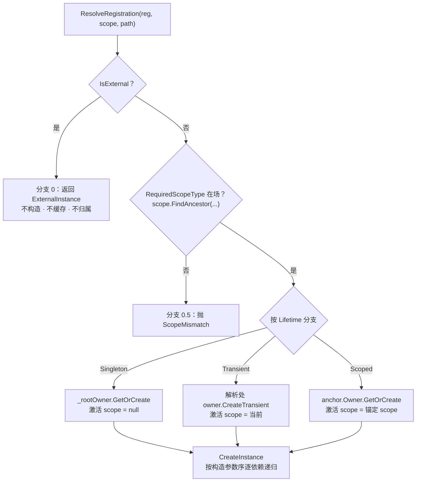

逐分支解读：

- **分支 0（外部实例）**：`AddSingleton(instance)` 注册的服务不经过任何缓存与构造——永远返回同一个外部对象。它也不归属任何 owner（调用方负责释放），见第 9 章。
- **分支 0.5（作用域预检）**：第 6.5 节讲的需求检查。注意 `FindAncestor` 是"从当前 scope 沿父链找标记"——根容器解析（`scope == null`）且服务有需求 → 必然 `ScopeMismatch`（根不在任何 scope 内）。
- **分支 1（Singleton）**：永远挂 `_rootOwner`，激活时 `scope=null`（所以它的依赖若是 Scoped 也在构建期被拦，运行期不可能出现）；多个 scope 解析同一单例拿到同一实例。
- **分支 2（Transient）**：归**发起解析的 scope** 的 owner（根解析则归 `_rootOwner`）。注意激活时把当前 `scope` 传下去——Transient 内部的依赖递归仍在当前上下文解析（见 `Transients_AreOwnedByTheResolvingScope`：同一 scope 内两次解析两个独立实例，scope 释放时一起 Dispose）。
- **分支 3（Scoped）**：先 `FindAncestor(registration.ScopeType)` 定位**锚定 scope 实例**（Encounter 里解析 Run 锚定的服务会找到祖先 Run 实例），然后实例挂在 `anchor.Owner`。**注意激活时传的是 `anchor` 而非 `scope`**——Scoped 实例的依赖递归在锚定 scope 上下文执行，保证"属于 Run 的服务，其内部 Transient 也归 Run"，生命周期一致。

### 7.4 激活：`CreateInstance`

```csharp
private object CreateInstance(ServiceRegistration registration, ServiceScope scope, IList<Type> path)
{
    var plan = _model.Plans[registration.Id];
    path.Add(registration.ImplementationType);
    try
    {
        var arguments = new object[plan.Dependencies.Count];
        for (var index = 0; index < plan.Dependencies.Count; index++)
        {
            var dependencyPlan = plan.Dependencies[index];
            if (dependencyPlan.IsCollection)
            {
                arguments[index] = ResolveCollection(dependencyPlan.ServiceType, scope, path);
                continue;
            }
            var dependency = _model.DefaultRegistrations[dependencyPlan.ServiceType];
            arguments[index] = ResolveRegistration(dependency, scope, path);   // ← 递归
        }
        try
        {
            var instance = plan.Constructor.Invoke(arguments);
            _diagnostics.Write(new DiDiagnosticEvent(InstanceCreated, ...));
            return instance;
        }
        catch (TargetInvocationException error)
        {
            throw new DependencyInjectionException(ActivationFailed,
                "...constructor threw...", ..., path, inner: error.InnerException ?? error);
        }
    }
    finally
    {
        path.RemoveAt(path.Count - 1);
    }
}
```

要点：

- **逐参递归**：按 `plan.Dependencies`（构建期算好的参数顺序）逐个 `ResolveRegistration`——`path` 此刻记录"激活链"，错误路径因此能追溯到完整的构造嵌套（如 `[A, B]` 表示构造 A 时需要构造 B）。
- **集合参数**直接注入数组（第 10 章）。
- **构造失败包装**：`Constructor.Invoke` 会把用户异常包成 `TargetInvocationException`，这里解包后抛 `ActivationFailed` 并保留 `InnerException` 为原始用户异常（`TryResolve_DoesNotHideActivationFailure` 断言 `InnerException` 是用户异常类型）。注意 `ActivationFailed` 的 `DependencyPath` 是**激活链**（构造到一半的路径），与"注册缺失"的完整图路径不同但同样可用。
- **`path` 用 try/finally 维护**：递归返回后 pop，保证路径只反映当前活动链。

### 7.5 缓存与归属：`LifetimeOwner`

```csharp
public object GetOrCreate(int registrationId, Func<object> factory)
{
    lock (_gate)
    {
        EnsureNotDisposed();
        var isNew = !_instances.TryGetValue(registrationId, out var instance);
        if (isNew)
        {
            instance = new Lazy<object>(factory, LazyThreadSafetyMode.ExecutionAndPublication);
            _instances.Add(registrationId, instance);
        }
        var value = instance.Value;   // Lazy：多线程并发也只构造一次
        if (isNew) Track(value);      // 新实例且是 IDisposable → 记入归属清单
        return value;
    }
}

public object CreateTransient(Func<object> factory)
{
    lock (_gate)
    {
        EnsureNotDisposed();
        var value = factory();        // 每次都构造
        Track(value);
        return value;
    }
}
```

三个语义点（测试背书都在 `OwnershipAndConcurrencyTests.cs`）：

1. **`Lazy(ExecutionAndPublication)` 保证并发只构造一次**：16 线程并发解析同一单例/同一 scope 的同一 Scoped，`Lazy.Value` 只执行一次 factory（`ConcurrentSingletonResolution_ConstructsExactlyOnce`、`ConcurrentScopedResolution_ConstructsOncePerScope`）。注意 owner 的 `_gate` 锁外仍有 `Lazy` 双保险——两个不同解析入口同时到达时，owner 锁先串行化，`Lazy` 再兜底。
2. **构造失败不重试且不产生新实例**：factory 抛异常（`ActivationFailed`）后，该 `Lazy` 被标记为已失败；同 `Id` 再次解析直接重抛缓存的异常，**不会重新执行构造**（`FaultedSingleton_DoesNotRetryConstruction`，构造计数器 = 1）。这是 fail-fast 纪律：构造失败的组件视为不可用，避免"半初始化对象"流窜。
3. **`Track` 只记 `IDisposable`**：非 `IDisposable` 实例不进入 `_ownedInstances`，释放时无需处理（也没有泄漏——实例本身由持有方 GC 管理；DI 只负责它创建且需要确定性释放的那些）。

### 7.6 诊断与失败上报

解析路径上任意 `DependencyInjectionException` 都会被 `ResolveForScope`/`ResolveAllForScope` 的 catch 捕获，发一条 `ResolutionFailed` 诊断（携带 serviceType/scopeType/errorCode），然后 `throw;` 原样重抛（`ReportResolutionFailure`）。所以**诊断只观察、不吞错**；诊断 sink 本身抛异常才被吞掉（第 12 章）。

---

## 8. 作用域层级：创建规则与祖先查找

*图示：scope 定义树（类型，构建期）与运行期实例树必须同构；FindAncestor 沿父链查找决定服务可见性。同一标记可有多个并存实例（两局 Run）。*

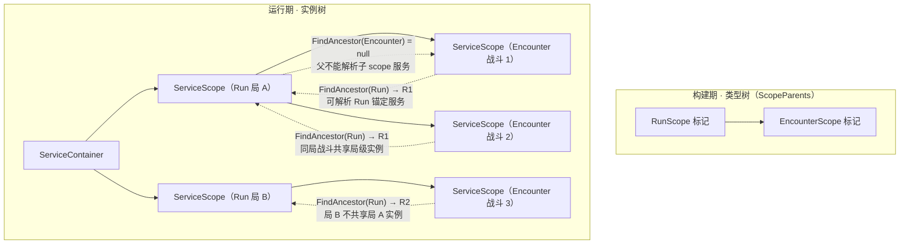

### 8.1 `CreateScope` 的校验链

`ServiceScope.CreateScope<TScope>()` / `ServiceContainer.CreateScope<TScope>()` 都委托给容器内部的 `CreateChildScope(parent, scopeType)`：

```csharp
internal ServiceScope CreateChildScope(ServiceScope parent, Type scopeType)
{
    lock (_lifecycleGate)
    {
        EnsureNotDisposed();
        if (scopeType == null) throw ArgumentNullException(...);
        if (!_model.ScopeParents.TryGetValue(scopeType, out var expectedParent))
            throw InvalidScopeDefinition("The requested scope marker is not defined.", scopeType);
        var actualParent = parent?.ScopeType;
        if (expectedParent != actualParent)
            throw ScopeMismatch("The scope must be created from its declared direct parent.", scopeType);
        var scope = new ServiceScope(this, parent, scopeType);
        if (parent == null) _rootScopes.Add(scope);
        else parent.RegisterChild(scope);
        _diagnostics.Write(new DiDiagnosticEvent(ScopeCreated, scopeType: scopeType));
        return scope;
    }
}
```

按序四道闸：

1. **容器未释放**（`EnsureNotDisposed`）。
2. **scope 标记必须被 `DefineScope` 定义过** → 否则 `InvalidScopeDefinition`。
3. **创建处的直接父必须与定义一致** → `DefineScope<Encounter, Run>` 意味着只能从 `RunScope` 实例创建 Encounter；直接从容器建 Encounter 或从其他 scope 建都 `ScopeMismatch`（`CreateScope_RejectsWrongDirectParent`：容器上建 EncounterTag 被拒）。父为 null 时只能从容器建（根 scope）。
4. 实例登记到 `_rootScopes`（父 null）或父的 `_children`。

> **为什么要"声明过的直接父"而不是任意嵌套？** 因为 scope 定义是"类型树"（哪些 scope 能嵌在哪些里），运行期创建必须与类型树同构——否则第 6 章在类型树上做的 captive/祖先分析就不适用了。`Build_RejectsScopeDefinitionCycle` + `CreateScope_RejectsWrongDirectParent` 一前一后锁住定义期与运行期。

### 8.2 `FindAncestor`：作用域服务的定位器

```csharp
internal ServiceScope FindAncestor(Type scopeType)
{
    for (var current = this; current != null; current = current.Parent)
        if (current.ScopeType == scopeType) return current;
    return null;
}
```

两处用途（第 7 章已见）：作用域预检（找得到 = 需求满足）与 Scoped 锚定（找得到 = 拿到承载 owner 的 scope 实例）。因为父链从当前 scope 一直延伸到根，**Encounter 里总能找到 Run**；反过来 Run 里 `FindAncestor(Encounter)` 必然 null → 访问子作用域服务失败。

### 8.3 可见性结论

| 场景 | 结果 | 依据 |
|---|---|---|
| 子作用域解析祖先锚定的 Scoped | ✅ 共享同一实例 | `ChildScope_CanResolveParentScopedDependency` |
| 两个 Encounter 解析 Run 锚定的服务 | ✅ 同一实例（Run 级共享） | `EncounterScopes_ShareRunServiceButNotEncounterService` |
| 两个 Encounter 各自解析 Encounter 锚定的服务 | ❌ 各自实例 | 同上（`Is.Not.SameAs`） |
| 两个 Run 之间 | ❌ 不共享 | `SeparateRunScopes_DoNotShareRunService` |
| 根解析 Scoped / 父解析子 scope 服务 | ❌ `ScopeMismatch` | `Resolve_RejectsScopedServiceOutsideRequiredScope` / `ParentScope_CannotResolveChildScopedService` |
| 需求 scope 不在场时解析 Transient(→Scoped) | ❌ `ScopeMismatch`（路径含链） | `TransientWithRunDependency_ResolvesOnlyInsideRunDescendants` |

scope 实例树与对象归属的关系：**一个 `ServiceScope` 实例 = 一个 `LifetimeOwner` = 一组 Scoped/Transient 实例的"作用域边界"**。释放一个 scope 实例，只释放这个实例的 owner 里的对象——两个并存 Run 互不干扰（每局各自释放自己的）。

---

## 9. 确定性释放：谁拥有谁、按什么顺序释放

### 9.1 归属表（本模块最核心的不变量）

| 实例来源 | 挂载 owner | 谁负责 Dispose | 背书测试 |
|---|---|---|---|
| `AddSingleton<...>()` 容器创建 | 根 `_rootOwner` | 容器 `Dispose()` | `Container_DisposesActiveScopesBeforeRootInstances` |
| `AddSingleton(instance)` 外部 | 无（不 Track） | **调用方** | `ExternalDisposableInstance_IsNotDisposedByContainer` |
| `AddScoped<..., TScope>()` | 锚定 scope 实例的 owner | 该 scope `Dispose()` | `ParentScope_DisposesChildrenBeforeParentInstances` |
| `AddTransient<...>()` | 发起解析的 scope/容器 owner | 该 scope/容器 `Dispose()` | `Transients_AreOwnedByTheResolvingScope` |

**外部实例永不进 `_ownedInstances`**：`AddSingleton(instance)` 走注册分支 0 直接返回对象，owner 的 `Track` 只在 `GetOrCreate`/`CreateTransient` 的"新构造"路径被调用，外部实例从不过这条路径。

*图示：归属与释放（§9.1）。每条容器创建/scope 解析的实例都挂某 owner 并记账；外部实例从不过 owner 的 Track 路径，容器只存引用、由调用方负责释放。*

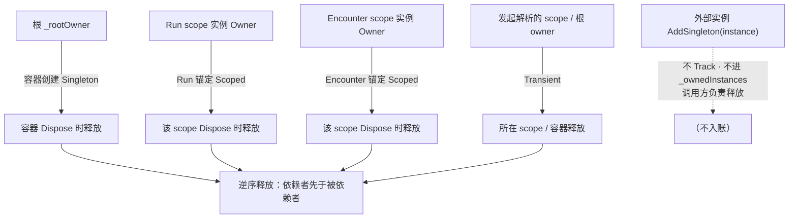

### 9.2 三份 Dispose，同一模式

`ServiceContainer.Dispose`、`ServiceScope.Dispose`、`LifetimeOwner.Dispose` 结构完全一致：**锁内幂等快照 → 锁外逆序释放 → 聚合错误 → 最后才抛**。

```csharp
// ServiceScope.Dispose（容器/owner 同构）
public void Dispose()
{
    List<ServiceScope> children;
    lock (_lifecycleGate)
    {
        if (_disposed) return;              // 幂等
        _disposed = true;
        children = new List<ServiceScope>(_children);
        _children.Clear();                  // 快照后清空，之后 RegisterChild 会 EnsureNotDisposed 拒绝
    }
    var errors = new List<Exception>();
    for (var index = children.Count - 1; index >= 0; index--)
        DisposalExceptionCollector.Capture(errors, children[index].Dispose);   // ① 子 scope 逆序
    DisposalExceptionCollector.Capture(errors, Owner.Dispose);                 // ② 本 scope 实例逆序
    _container.NotifyScopeDisposed(this);                                       // ③ 从父/根注销 + ScopeDisposed 诊断
    DisposalExceptionCollector.ThrowIfAny(errors);
}
```

释放顺序可归纳为三条嵌套规则（依赖者先于被依赖者）：

1. **容器释放**：活跃根 scopes 逆序 → 根实例（`Container_DisposesActiveScopesBeforeRootInstances`：`run` 先于 `root`）。
2. **scope 释放**：子 scopes 逆序 → 本 scope 实例（`ParentScope_DisposesChildrenBeforeParentInstances`：`encounter` 先于 `run`）。
3. **owner 释放**：`_ownedInstances` 逆序——即**创建逆序**。依赖先构造、依赖者后构造 → 逆序 = 依赖者先释放（`Scope_DisposesDependentsBeforeDependencies`：`service` 先于 `dependency`）。

**为什么必须逆序**：被依赖对象通常被依赖者订阅/引用（事件订阅最典型），先释放被依赖者会让依赖者在自己的 Dispose 里访问已释放对象（或反过来把退订动作留到对象死亡后）。逆序保证"谁依赖谁，谁先走"——这正是 `docs/design/01-di.md` 所述"释放顺序 = 事件退订时机"的机制来源。

### 9.3 聚合错误与继续释放

`DisposalExceptionCollector.Capture` 捕获每个 `Dispose()` 的异常（含对 `AggregateException` 的 `Flatten()` 拆解）汇入 `errors`，**不中断后续释放**；全部结束后若 `errors` 非空，抛 `AggregateException`（`Dispose_ContinuesAfterFailureAndAggregatesErrors`：一个 Dispose 抛错，后面的仍执行，最终聚合成一个 `AggregateException`，错误数 = 1）。

### 9.4 释放后的状态

- **幂等**：`Dispose()` 两次，第二次直接 return（`Dispose_IsIdempotent`）。
- **释放后拒绝一切**：容器/scope 的 `EnsureNotDisposed` 在每次解析、建 scope 前检查 → 抛 `ContainerDisposed`（`Resolve_AfterDispose_ThrowsContainerDisposed`；`DisposedScope_RejectsResolutionAndChildCreation`）。释放后新解析的唯一出路是重新 `Build()` 新容器。

---

## 10. 集合注入

### 10.1 识别与解析

集合的唯一识别点是构造参数类型 `IReadOnlyList<T>`（第 5.4(d) 节的 `BuildDependencyPlan`）。运行期解析集合走 `ResolveCollection`：

```csharp
private object ResolveCollection(Type serviceType, ServiceScope scope, IList<Type> path)
{
    if (!_model.CollectionRegistrations.TryGetValue(serviceType, out var registrations))
        return Array.CreateInstance(serviceType, 0);   // 未注册任何条目 → 空数组（安全）
    var result = Array.CreateInstance(serviceType, registrations.Count);
    for (var index = 0; index < registrations.Count; index++)
        result.SetValue(ResolveRegistration(registrations[index], scope, path), index);
    return result;
}
```

*图示：集合注入的保序链路（§10.1）。注册序 → CollectionRegistrations 分组保序 → ResolveCollection 按下标逐个解析 → ResolveAll 数组保序。类型名与测试语义一致（接口名示意）。*

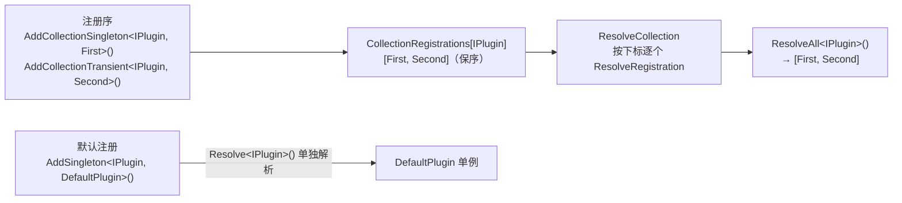

语义（测试均在 `CollectionAndDiagnosticsTests.cs`）：

| 行为 | 说明 | 测试 |
|---|---|---|
| 顺序 | 数组保持注册顺序 | `Collection_UsesOnlyExplicitEntriesInRegistrationOrder`（返回 `[First, Second]`；默认注册的 `DefaultPlugin` 不进集合，`Resolve<IPlugin>` 单独返回它） |
| 与默认注册并存 | 集合与默认服务互不干扰：`Resolve<T>` 得默认，`ResolveAll<T>` 得集合 | 同上 |
| 空集合 | 未注册 → 空数组，不报缺失 | `MissingCollection_ResolvesAndInjectsAsEmptyReadOnlyList`（构造注入 `Plugins` 为空） |
| 条目生命周期 | 各条目按自己注册的生命周期解析（Singleton 共享、Transient 每次新建） | `CollectionEntries_RespectTheirOwnLifetimes` |
| Scoped 条目 | 要求声明 scope 在场并复用该 scope 实例 | `ScopedCollection_RequiresAndReusesItsDeclaredScope`（根解析抛 `ScopeMismatch`，Run 内两次解析同一实例） |
| captive | Singleton 消费者注入 Scoped 集合 → `Build()` 拦 | `SingletonConsumer_CannotCaptureScopedCollection` |
| 兄弟冲突 | 一个消费者的集合条目来自兄弟 scope → `Build()` 拦 | `Consumer_CannotRequireCollectionsFromSiblingScopes` |

### 10.2 集合在生命周期校验里被"展开"

第 6.2 节可见：`DetermineRequiredScope` 对集合依赖**逐条目**做 `MergeDependencyRequirement`，因此集合条目的作用域需求会像普通依赖一样向上传播与合并——这就是集合 captive 与兄弟冲突能在构建期被抓的原因。集合容器自身不是注册，没有独立 `Id`，每次解析都实时构造新数组（数组本身无状态、不归属）。

---

## 11. 错误模型：从异常到定位注册代码

### 11.1 异常结构

`DependencyInjectionException : InvalidOperationException` 携带四件套：

```csharp
public DependencyErrorCode Code { get; }          // 见 11.2 表
public Type ServiceType { get; }                  // 出问题的服务类型
public Type ImplementationType { get; }           // 出问题的实现类型（外部实例/解析入口时可为 null）
public IReadOnlyList<Type> DependencyPath { get; }// 类型链：从消费者到问题点
```

`DependencyPath` 是**类型链而非字符串**——测试里可直接与 `new[] { typeof(...), ... }` 断言，日志里可读作"谁要了谁"。它总是从最外层的解析消费者开始，到真正的问题类型结束。**定位方法**：从右往左读，最后一个是问题根因，左边每一级是"谁带它进来的"。

### 11.2 十种错误码速查

| Code | 抛出阶段 | 触发场景 | 示例 / 测试 | 修复方向 |
|---|---|---|---|---|
| `DuplicateRegistration` | 构建 | 同一服务类型重复注册 | `Build_RejectsDuplicateDefaultRegistration` | 删掉多余注册（或用集合） |
| `InvalidImplementation` | 构建 | 实现是抽象/接口/开放泛型/不可赋值；外部实例为 null | `Build_RejectsAbstractImplementation` | 换具体封闭实现类 |
| `AmbiguousConstructor` | 构建 | 构造器选择失败（见 5.4(c) 表） | `Build_RejectsUnmarkedAmbiguousConstructors` | 单构造器，或给唯一一个加 `[InjectConstructor]` |
| `MissingDependency` | 构建（图）/ 运行（Resolve 未注册类型） | 依赖类型未注册；Resolve 了未注册服务 | `Build_RejectsMissingConstructorDependency` / `ResolveUnknownService_ProvidesStructuredFailure` | 注册缺失类型 |
| `CircularDependency` | 构建 | 依赖图成环（含间接/集合内） | `Build_RejectsIndirectCycle` | 拆环（事件/懒引用/工厂） |
| `InvalidScopeDefinition` | 构建 / 运行（CreateScope） | scope 重复定义 / 父未定义 / 定义环；创建未定义 scope | `Build_RejectsScopeDefinitionCycle` | 修正 `DefineScope` |
| `ScopeMismatch` | 构建（兄弟）/ 运行 | 兄弟 scope 需求不可合并；在错误 scope/根解析 Scoped | `Build_RejectsServiceRequiringSiblingScopes` / `Resolve_RejectsScopedServiceOutsideRequiredScope` | 在正确 scope 内解析；或调整服务粒度 |
| `CaptiveDependency` | 构建 | Singleton 捕获 Scoped（含穿透）；Scoped 依赖后代 | `Build_RejectsSingletonCapturingRunScopeThroughTransient` | 把捕获者降为 Transient/Scoped，或把被捕获者提升 |
| `ContainerDisposed` | 运行 | 释放后 Resolve / CreateScope | `DisposedScope_RejectsResolutionAndChildCreation` | 重建容器；检查生命周期次序 |
| `ActivationFailed` | 运行 | 构造函数抛异常（保留 `InnerException`） | `TryResolve_DoesNotHideActivationFailure` | 看 `InnerException` |

前七种是"配置写错"，全部在 `Build()` 暴露（构建期校验的价值）；后三种是"运行期状态错"，在解析/释放时暴露。

### 11.3 Unity 侧错误模型

`RazorFramework.Unity.DI` 使用独立异常 `UnityInjectionException : InvalidOperationException`，字段 `TargetType / MemberName / ServiceType` + `UnityInjectionErrorCode`（`WrongThread / InvalidMember / MissingDependency / AssignmentFailed`），语义见第 13 章。

---

## 12. 诊断：观察不改变行为

### 12.1 事件种类与字段

```csharp
public enum DiDiagnosticKind { ContainerBuilt, ScopeCreated, InstanceCreated, ResolutionFailed, ScopeDisposed, ContainerDisposed }

public readonly struct DiDiagnosticEvent
{
    public DiDiagnosticKind Kind { get; }
    public Type ServiceType { get; }        // 相关服务类型
    public Type ImplementationType { get; } // 相关实现类型
    public Type ScopeType { get; }          // 相关 scope 标记
    public DependencyErrorCode? ErrorCode { get; } // ResolutionFailed 时的错误码
}
```

`Diagnostics_ReportStableLifecycleAndResolutionFields` 给出完整事件流示例：`ContainerBuilt → ScopeCreated → InstanceCreated(单例, ScopeType=null) → InstanceCreated(Scoped, ScopeType=RunTag) → ResolutionFailed(缺依赖) → ScopeDisposed → ContainerDisposed`。

### 12.2 观察契约

```csharp
public void Write(DiDiagnosticEvent diagnosticEvent)
{
    if (_sink == null) return;
    try { _sink.Write(diagnosticEvent); }
    catch { /* Diagnostics are observational and must not alter container behavior. */ }
}
```

sink 通过 `ContainerOptions.DiagnosticSink` 注入，只在 `ServiceContainer` 构造时用 `DiagnosticDispatcher` 包一层。**sink 抛异常被吞掉**（`DiagnosticSinkFailure_DoesNotChangeContainerBehavior`）；解析失败走"先诊断后重抛"（第 7.6 节），容器行为不受诊断影响。用途：日志、测试断言、可视化调试——不能用于实现业务逻辑。

---

## 13. Unity 适配层：UnityObjectInjector 与 UnityMainThread

### 13.1 适配层存在的意义

`RazorFramework.DI` 核心是纯 C#、不碰 `UnityEngine`。但 Unity 对象（MonoBehaviour 等）不能走构造注入——它们由 Unity 实例化。`RazorFramework.Unity.DI` 补上**成员注入**通道：给现有 Unity 对象的字段/属性打上 `[Inject]`，由注入器把容器里的服务赋进去。asmdef `autoReferenced: false` + 显式引用 DI，确保它只作为可选适配存在。

### 13.2 UnityMainThread：fail-closed 主线程守护

```csharp
[RuntimeInitializeOnLoadMethod(RuntimeInitializeLoadType.SubsystemRegistration)]
private static void ResetRuntimeState() { Volatile.Write(ref _threadId, 0); Volatile.Write(ref _initialized, 0); }

[RuntimeInitializeOnLoadMethod(RuntimeInitializeLoadType.BeforeSceneLoad)]
private static void CaptureRuntimeThread() { CaptureCurrentThread(); }

internal static void EnsureCurrent()
{
    var initialized = Volatile.Read(ref _initialized);
    var expectedThread = Volatile.Read(ref _threadId);
    if (initialized != 1 || Thread.CurrentThread.ManagedThreadId != expectedThread)
        throw new UnityInjectionException(WrongThread, "...requires the Unity main thread...");
}
```

两个 `[RuntimeInitializeOnLoadMethod]` 钩子建立时序：**SubsystemRegistration**（最早，每次进入 Play 都会跑）先清空旧状态（域重载时静态字段残留问题），**BeforeSceneLoad** 捕获主线程身份。`CaptureCurrentThread` 用 `Interlocked.CompareExchange(0 → 当前线程)`——若已被其他线程占用则抛 `WrongThread`（身份不可被替换）。

此后 `EnsureCurrent()` 是纯读检查：未初始化（比如测试环境没走 Unity 初始化）或当前线程 ≠ 捕获线程 → **fail-closed**（宁可抛错，不碰对象）。`InitializeForTests` 仅供 EditMode 测试在 `[SetUp]` 里自建主线程身份。

*图示：UnityMainThread 两个 [RuntimeInitializeOnLoadMethod] 钩子建立的主线程捕获时序（§13.2）。Unity 保证 SubsystemRegistration 先于 BeforeSceneLoad，因此「先清残留、再锁身份」的次序是确定的。*

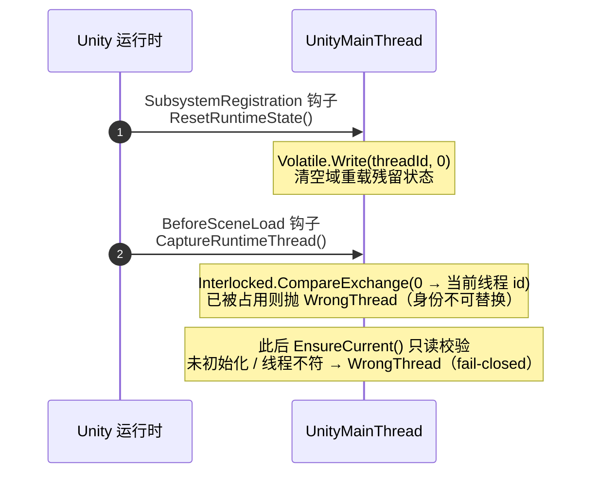

### 13.3 UnityObjectInjector：成员计划

构造与每次 `Inject` 都先 `UnityMainThread.EnsureCurrent()`，然后：

```csharp
public void Inject(UnityEngine.Object target)
{
    UnityMainThread.EnsureCurrent();
    if (target == null) return;                    // null 与已销毁对象都是安全 no-op
    var plans = CachedPlans.GetOrAdd(target.GetType(),
        type => new Lazy<MemberPlan[]>(() => BuildPlans(type), LazyThreadSafetyMode.ExecutionAndPublication)).Value;
    foreach (var plan in plans)
    {
        if (!_resolver.TryResolve(plan.ServiceType, out var service))
        {
            if (plan.IsOptional) continue;         // 可选：未注册就跳过
            throw new UnityInjectionException(MissingDependency, ..., targetType, plan.MemberName, plan.ServiceType);
        }
        try { plan.Assign(target, service); }
        catch (Exception error)
        { throw new UnityInjectionException(AssignmentFailed, ..., inner: error); }
    }
}
```

按序：主线程 → null/销毁对象 no-op → 取成员计划 → 逐成员解析与赋值。要点：

- **`target == null`**：Unity 重载了 `==`，已 `Destroy` 的对象在托管引用层面已为 null，直接返回（`Inject_NullAndDestroyedObjects_AreNoOpOnOwnerThread`）。
- **计划缓存**：`ConcurrentDictionary<Type, Lazy<MemberPlan[]>>` 按类型缓存；多线程首次并发也只构建一次。
- **`TryResolve` 而非 `Resolve`**：为了支持可选依赖；必需依赖未注册时报带成员上下文的 `MissingDependency`（`MissingRequiredDependency_ReportsStructuredMemberContext`：`TargetType/MemberName/ServiceType` 齐全）。
- **赋值失败单独成码**：类型不匹配等赋值错误包成 `AssignmentFailed` 且保留 `InnerException`（`AssignmentTypeMismatch_IsReportedWithInnerException`）。

**成员计划构建**（`BuildPlans`）：

```csharp
var hierarchy = new Stack<Type>();
for (var current = targetType; current != null; current = current.BaseType) hierarchy.Push(current);
// ↑ 先压最底层，弹出来 = 基类 → 派生类
while (hierarchy.Count > 0)
{
    var declaringType = hierarchy.Pop();
    var members = declaringType.GetMembers(DeclaredMembers)   // Instance|Static|Public|NonPublic|DeclaredOnly
        .Where(IsInjectionMember)                             // 带 [Inject] 或 [InjectOptional]
        .OrderBy(member => member.MetadataToken);             // 同一类型内按元数据声明顺序
    foreach (var member in members) plans.Add(BuildMemberPlan(targetType, member));
}
```

顺序纪律：**基类成员先于派生类成员**（派生类构造依赖基类字段先就绪），同一类型内按 `MetadataToken`（≈ 声明顺序）。测试 `Inject_UsesBaseToDerivedMetadataOrder` 用记录型 resolver 验证了请求顺序 = 基类两个字段 → 派生类字段。

**成员合法性**（`BuildMemberPlan`，非法形状在**首次构建计划时**就抛 `InvalidMember`，早于任何对象注入）：

| 要求 | 非法形状（均 `InvalidMember`） | 测试 |
|---|---|---|
| `[Inject]` / `[InjectOptional]` 恰一个 | 同时标两个 | `ConflictingAttributeTarget` |
| 可变**实例**字段 | static / readonly / const | `StaticFieldTarget` / `ReadonlyFieldTarget` |
| 非索引、有 setter 的**实例**属性 | 索引器 / 无 setter / static setter | `IndexerTarget` / `GetOnlyPropertyTarget` / `StaticPropertyTarget` |
| 只能字段/属性 | 方法、事件等 | 代码注释明确 |

注意私有字段/私有 setter 是**允许**的（测试 `BaseTarget` 用私有字段 `[Inject]`），因为 `DeclaredMembers` 含 `NonPublic` 且 `FieldInfo.SetValue` / `PropertyInfo.SetValue`（`GetSetMethod(true)` 取非 public setter）都能工作。

*图示：UnityObjectInjector.Inject 决策流（§13.3）。主线程 fail-closed 守护在入口；成员计划按类型缓存一次；解析/赋值失败各有独立错误码。*

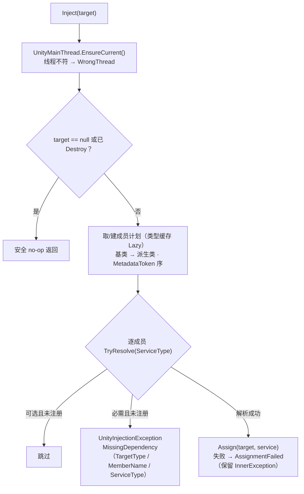

整个注入失败集被缓存：若类型定义非法，首次注入抛 `InvalidMember` 并缓存，后续同类型注入不再重复构建计划。

**驱动现状（2026-09-06 起有根驱动）**：`GameBootstrap`（`[DefaultExecutionOrder(-32000)]`，Awake 全场景最先）建组合根后调用 `CardGame.Runtime` 的 `SceneInjection.InjectScene(Container)`——扫描场景全部 MonoBehaviour（含 inactive）逐个注入，先于其他脚本的 Awake/OnEnable。对齐法则：对象的生命周期必须 ≤ 注入 resolver 的生命周期；常驻场景对象只能拿 Singleton（注入 Scoped 抛 `ScopeMismatch`）；scope 拥有的屏由创建 scope 的驱动方从该 scope 注入并先于 scope 销毁（规格：`docs/superpowers/specs/2026-09-06-scene-inject-driver-design.md`）。运行时动态创建的对象不在根驱动范围——谁创建谁注入。改动注入器前务必先补 UnityObjectInjectorTests 类测试。

---

## 14. CardGame 实操指南：组合根、新服务、常见错误

### 14.1 组合根与作用域标记（真实代码）

**作用域标记**（`Scopes.cs`）只是两个空 class，语义全在注释里：

```csharp
public sealed class RunScope { }        // 单局：卡组/遗物/血量/金钱/地图进度
public sealed class EncounterScope { }  // 战斗：引擎/伤害管线/属性/意图（Run 的子）
```

**组合根**（`GameComposition.cs`）——全应用唯一知道所有具体类型的地方：

```csharp
public sealed class GameComposition : IDisposable
{
    public ServiceContainer Container { get; }
    public GameFlow Flow { get; }

    public GameComposition(DataRepository data)
    {
        var builder = new ContainerBuilder();
        builder.DefineScope<RunScope>();
        builder.DefineScope<EncounterScope, RunScope>();
        builder.AddSingleton(data);       // 外部实例：仓库归 GameComposition 所有，容器不 Dispose
        builder.AddSingleton<GameFlow>(); // 构造注入 DataRepository
        Container = builder.Build();       // ← 校验失败在此抛（写错注册立刻知道）
        Flow = Container.Resolve<GameFlow>();
    }

    public void StartFlow() => Flow.Start();   // 显式启动屏障
    public void Dispose() => Container.Dispose();
}
```

**入口**（`GameBootstrap.cs`）——场景唯一入口，MonoBehaviour 只做"生命周期翻译"：

```csharp
private void Awake() { _composition = new GameComposition(LoadRepository()); _composition.StartFlow(); }
private void OnDestroy() { _composition?.Dispose(); _composition = null; }
```

三层分工值得记住：
- **MonoBehaviour（GameBootstrap）**：只在 Unity 事件（Awake/OnDestroy）与组合根之间翻译；不包含业务。
- **组合根（GameComposition）**：定义 scope、做注册、`Build()`、`Resolve` 出根服务、暴露 `Dispose`。
- **业务服务（GameFlow）**：纯 C#，构造注入 `DataRepository`，通过显式 `Start()` 跨越"构造完成"与"开始交互"的屏障。

测试背书在 `GameCompositionTests.cs`：单例共享（`Build_RegistersDataAndFlowAsSingletons`）、层级解析（`ScopeHierarchy_RunThenEncounter_ResolvesAncestorServices`）、显式启动屏障（`StartFlow_SetsWorldTitleOnlyAfterExplicitStart`：Start 前 `WorldTitle` 为 null）、释放后拒用（`Resolve_AfterDispose_ThrowsContainerDisposed`）。

*图示：组合根装配时序（§14.1）。外部实例（DataRepository）由 GameBootstrap 在 Awake 里先装配好再传入——对象就绪先于任何 Resolve；GameFlow 构造时经分支 0 原样取回。*

```mermaid
sequenceDiagram
    autonumber
    participant Boot as GameBootstrap (MonoBehaviour)
    participant Ld as GameDataLoader
    participant Comp as GameComposition
    participant B as ContainerBuilder
    participant Cont as ServiceContainer
    participant Flow as GameFlow

    Boot->>Ld: Awake() → LoadRepository()<br/>（读 8 个 TextAsset）
    Ld-->>Boot: DataRepository（校验 + 冻结）
    Boot->>Comp: new GameComposition(data)
    Comp->>B: DefineScope&lt;RunScope&gt;()
    Comp->>B: DefineScope&lt;EncounterScope, RunScope&gt;()
    Comp->>B: AddSingleton(data)<br/>（外部实例：不构造 / 不 Dispose）
    Comp->>B: AddSingleton&lt;GameFlow&gt;()
    B->>B: Build() 五组校验 → 冻结
    Comp->>Cont: Resolve&lt;GameFlow&gt;()
    Cont->>Cont: 解析依赖 DataRepository<br/>→ 分支 0 原样取回外部实例
    Cont-->>Comp: GameFlow 实例
    Boot->>Flow: StartFlow()（显式启动屏障）
    Note over Boot,Comp: OnDestroy → Comp.Dispose() → Container.Dispose()<br/>外部实例不在容器账内，归组合根本人所有
```

### 14.2 怎么新增一个服务（遭遇级示例）

假设实现战斗引擎最小切片，需一个遭遇级服务：

```csharp
// 1) 服务类：纯 C#，构造注入声明依赖（当前 Run/Encounter 标记已在 Scopes.cs）
public sealed class DamagePreviewService
{
    private readonly IRng _rng;                 // 依赖接口……
    public DamagePreviewService(IRng rng) { _rng = rng; }
}

// 2) 在 GameComposition 注册：
builder.AddScoped<IRng, SystemRng, RunScope>();          // 每局一个 RNG
builder.AddScoped<DamagePreviewService, EncounterScope>(); // 每场战斗一个预览服务
```

规则回顾：
- 服务构造函数**只声明抽象依赖**（接口/基类）；具体选择权在组合根。
- 同 Scope 的 RNG 想"换确定性实现给无头模拟"？在模拟测试的 builder 里注册 `AddScoped<IRng, SeededRng, RunScope>()` 即可——组合根是唯一需要知道具体类型的地方，业务代码零改动。
- 生命周期选择直觉：**跨局共享 → Singleton（但绝不持有局内状态，否则 captive 校验拦你）；单局 → Scoped+RunScope；单场战斗 → Scoped+EncounterScope；纯无状态工具/短命对象 → Transient**。

### 14.3 写测试的位置与模式

DI 行为测试放 `Assets/Plugins/RazorFramework/Tests/EditMode/DI/`（改核心前先补测试，TDD）；游戏组合根测试放 `Assets/CardGame/Tests/EditMode/Bootstrap/GameCompositionTests.cs`。模式一律是：**建 builder → 注册 → `Build()`（或断言抛错）→ 建 scope → Resolve/ResolveAll → 断言**。断言错误时检查 `.Code` 与 `.DependencyPath`，可先写一个注定失败的测试复现 bug，再修实现（见 AGENTS.md 的 test-driven-development 指引）。

### 14.4 常见错误 → 修复对照（从异常出发）

| 现象（运行/构建错误） | 错误码 | 实操修复 |
|---|---|---|
| `Build()` 抛 "registered once" | `DuplicateRegistration` | 找重复的 `Add*`；多实现意图用 `AddCollection*` |
| `Build()` 抛 "closed concrete type" | `InvalidImplementation` | 注册实现是具体类；`AddSingleton<IFoo>(foo)` 外部实例非 null |
| `Build()` 抛 "one public constructor" | `AmbiguousConstructor` | 收敛到一个构造器，或给目标构造器加 `[InjectConstructor]` |
| `Build()` 抛 "not registered" | `MissingDependency` | 补 `Add*` 缺失类型；确认作用域/程序集引用 |
| `Build()` 抛 "cycle" | `CircularDependency` | 拆依赖环：事件回调、`Lazy<T>`、工厂、拆分服务 |
| `Build()` 抛 "capture a scoped" | `CaptiveDependency` | 见 `.DependencyPath`：把尾部那个捕获者从 Singleton 降为 Transient/Scoped（肉鸽最常见：单例持有局状态） |
| `Build()` 抛 "incompatible sibling scopes" | `ScopeMismatch` | 一个服务同时依赖两个兄弟 scope 的服务 → 拆分服务或调整 scope 设计 |
| 运行期 Resolve 抛 "requires a scope" | `ScopeMismatch` | 在正确 scope 内解析：先 `CreateScope<RunScope>()` / `CreateScope<EncounterScope>()` 再 Resolve |
| 运行期 Resolve 抛 "container disposed" | `ContainerDisposed` | 生命周期次序 bug：在容器释放后还解析。检查组合根/场景释放时序 |
| 运行期 Resolve 抛 "constructor threw" | `ActivationFailed` | 看 `InnerException`——用户构造器真实异常 |
| Unity 注入抛 "main thread" | `WrongThread` | 主线程创建/调用 `UnityObjectInjector` |
| Unity 注入抛 "InvalidMember" | `InvalidMember` | 成员必须是可变实例字段 / 有 setter 的非索引实例属性，且 `[Inject]`/`[InjectOptional]` 恰一个 |

### 14.5 何时不要扩展

- 视图/UITK 面板是薄消费者：**不进容器建图**（原生生命周期 + presenter 引用）。`UnityObjectInjector` 已被 `SceneInjection` 根驱动启用（§13.3 驱动现状）；UI 面板本身仍是将来消费者，接入时再补接线。
- 单实现且无替身预期的服务：不注册，直接 new。
- 难度/种子等模式差异：用**数据表达**，不改注册图。
- 动 DI 核心行为前：先补测试再改实现；核心不得出现 `UnityEngine` 记号（Harness token 级检查）。

---

## 15. 关键不变量速查

| 不变量 | 机制 | 位置/背书 |
|---|---|---|
| 注册表构建后冻结 | `builder._consumed`；`EnsureMutable()` | Builder 第 4 章 / `SuccessfulBuild_ConsumesBuilder` |
| 错误在构建期全量暴露 | Validator 五组校验 → 结构化异常；失败不消耗 builder | 第 5/6 章 / `FailedBuild_DoesNotConsumeBuilder` |
| 运行期零决策 | `ContainerBuildModel` 不可变计划（构造器/依赖/作用域需求预计算） | 第 3/7 章 |
| Singleton → 根 owner，Scoped → 锚定 scope，Transient → 解析处 | `LifetimeOwner` 归属清单 | 第 9.1 章 / `Transients_AreOwnedByTheResolvingScope` |
| 外部实例永不 Dispose | 注册分支 0 不经过 owner `Track` | 第 7.3/9.1 章 / `ExternalDisposableInstance_IsNotDisposedByContainer` |
| 逆序释放（依赖者先走） | 三层嵌套逆序 + 快照 | 第 9.2 章 / `Scope_DisposesDependentsBeforeDependencies` |
| 释放失败聚合不中断 | `DisposalExceptionCollector` | 第 9.3 章 / `Dispose_ContinuesAfterFailureAndAggregatesErrors` |
| Dispose 幂等；释放后拒一切 | `_disposed` + `EnsureNotDisposed` | 第 9.4 章 / `Dispose_IsIdempotent` |
| Singleton/Scoped 并发只构造一次 | `Lazy(ExecutionAndPublication)` | 第 7.5 章 / `ConcurrentSingletonResolution_ConstructsExactlyOnce` |
| 构造失败不重试 | Lazy 缓存失败 | 第 7.5 章 / `FaultedSingleton_DoesNotRetryConstruction` |
| captive/兄弟 scope 构建期拦截 | `RequiredScopeType/Path` 传播 + 合并 | 第 6 章 / `Build_RejectsSingletonCapturingRunScopeThroughTransient` |
| 结构化错误带类型链 | `DependencyPath` 自消费者到根因 | 第 11 章 |
| 诊断观察不改变行为 | `DiagnosticDispatcher` 吞 sink 异常 | 第 12 章 / `DiagnosticSinkFailure_DoesNotChangeContainerBehavior` |
| Unity 适配 fail-closed | `UnityMainThread.EnsureCurrent` | 第 13 章 / `Inject_FromAnotherThread_IsRejectedBeforeUnityAccess` |
| 纯 C# 门禁 | asmdef `noEngineReferences` + Harness token 检查 | 第 2 章 |

---

## 附：延伸阅读

- 架构总览、程序集图、设计动机与 bug 发现时机论证：`docs/design/01-di.md`
- 按"入口 → 数据 → DI 核心 → 适配/测试"的阅读顺序（含每文件看点与自检题）：`docs/code-reading-order.md`
- 组合根与数据仓库：`docs/design/07-cardgame.md`
- 验证与测试运行：`docs/HARNESS.md` / `docs/design/08-verification.md`
