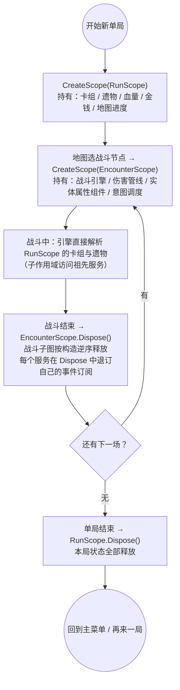
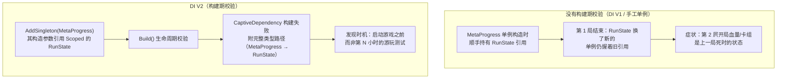
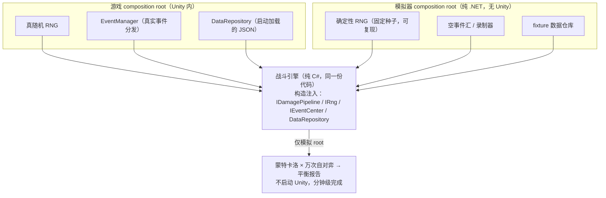

# Boot / Lifecycle 简化决策（开放问题 #8）

**状态：** 待决策（v2，按"技术深度优先"基准修订）
**日期：** 2026-09-02
**关联：** feat-003（blocked 于本决策）· [09-ui-resources.md](../../design/09-ui-resources.md) 简化建议节 · [03-lifecycle.md](../../design/03-lifecycle.md) · [05-boot.md](../../design/05-boot.md)
**决策方式：** 在文末决策记录表逐项填写，回复确认后执行

---

## 0. 评估基准（本次修订确立）

本决策不以"单人项目、当下省事"为论据，而是回答：**类杀戮尖塔的肉鸽卡牌，其问题域到底需要哪些结构**。

两条约束同时生效：

- **不做便利性妥协**：不为省眼前工夫砍掉游戏确实需要的机制；
- **不过度设计**：不建"以防万一"的通用框架——通用性只有在真实问题类出现时才是资产，否则是负债。

因此每个问题都按同一框架论证：这个机制解决什么问题类 → 该问题类在本游戏哪里出现 → 出现处用什么结构承接（本决策内 or 延后到玩法功能）。

---

## 1. 本项目的真实复杂度分布

先明确技术深度应该花在哪。类杀戮尖塔卡牌的结构性复杂度在以下五处（均为**玩法/领域层**问题，与 Boot/Lifecycle 框架层无关）：

| # | 复杂度来源 | 具体表现 | 承接位置 |
|---|---|---|---|
| 1 | **效果/状态结算顺序** | 回合开始时：格挡衰减、状态 tick、遗物触发、事件监听器的注册与优先级——顺序错误直接改变战斗结果 | 战斗引擎（纯 C#，未来功能）：伤害管线服务（DI）+ 实体属性组件（见 §1.1）+ Events 总线（已就位） |
| 2 | **单局状态与存档** | Run 状态（卡组/遗物/血量/金钱/地图进度）需可序列化，中途退出可恢复 | 领域模型（CardGame.Domain 已确立纯 C# 方向） |
| 3 | **地图生成** | 分层 DAG、节点分布、精英/Boss 位约束 | 领域模型，未来功能 |
| 4 | **无头平衡模拟** | 蒙特卡洛自对弈要求战斗引擎脱离 Unity 运行（CONTRACT §12 的 BalanceSimulator 诉求） | 战斗引擎纯 C# + 数据协议已落地（feat-006） |
| 5 | **UI 呈现同步** | 战斗状态 → 手牌/意图/血条/结算动效的刷新与动画排队 | UITK（runtime binding + scheduler） |

**关键判断**：卡牌战斗游戏的"顺序复杂度"几乎全部集中在第 1 项（效果结算顺序），这是**领域逻辑**问题；旧框架的"组件生命周期顺序"（Initialize/Start 两阶段）解决的是完全不同的问题类（见问题 1）。把结构预算花在第 1-5 项，而不是组件生命周期框架上——这就是"技术深度"与"过度设计"的分界线。

### 1.1 效果结算与属性系统的既定方向（2026-09-02 定调）

复杂度第 1 项的承接结构方向已定，作为未来战斗引擎功能的设计输入：

- **伤害管线服务（Damage Pipeline，DI 注入）**：伤害计算走显式管线（修饰按既定顺序应用），作为服务注册进容器、遭遇级注入战斗引擎——EncounterScope 由此获得第一个明确的未来消费者（直接支撑问题 3 的 composition root 决策）。
- **实体属性组件（运行时数据计算 + 脏标记 + 修饰器模式）**：实体（玩家/敌人）属性 = 基础值 + 修饰器栈（状态/遗物/临时效果挂修饰器）；派生值运行时计算并打脏标记，计算留在领域层，呈现层由脏标记驱动刷新（对齐 §1 第 5 项，无需自建帧驱动）。
- **对局序列化/日志化的结构基础**：该结构天然分离"持久数据"（基础值 + 修饰器来源）与"派生数据"（运行时重算）——对局存档（§1 第 2 项）只需序列化前者；事件/伤害审计与回放可在管线各阶段埋点。后续的存档与日志功能以此为地基，不另行发明。

以上在战斗引擎功能启动时细化为独立 spec；本决策只确认其与 #8 的接口：composition root 预留管线服务注册位，EncounterScope 保持遭遇级锚定语义。

### 1.2 DI 在本项目的切实性边界（2026-09-02 定调）

**判据（一般化）**：DI（构造注入 + 作用域生命周期）只在以下三者之一强存在时切实——① 对象生命周期嵌套且异质；② 需要可替换接缝做无头测试/模拟；③ 所有权与释放顺序必须确定。三者皆无则 DI 是仪式。类杀戮尖塔问题域三条全中：

**切实场景（容器承载，四个）：**

1. **Run → Encounter 生命周期映射**（最强论据）：RunScope（单局：卡组/遗物/血量/金钱/地图进度）嵌套 EncounterScope（每次战斗：引擎/伤害管线/实体属性组件/意图调度）；战斗结束整子图逆序释放，局结束 RunScope 释放。captive 校验防御肉鸽经典 bug——跨作用域捕获导致"新的一局带着上一局的状态"；手工管理这套所有权等于自建一个没有构建期校验的 DI。
2. **无头平衡模拟的接缝**（CONTRACT §12 蒙特卡洛硬需求）：战斗引擎构造注入 IDamagePipeline / IRng / IEventCenter / DataRepository；模拟器注入确定性 RNG、空事件汇、fixture 数据，万次自对弈不碰 Unity——"可模拟"由构造签名结构性保证。
3. **事件订阅的确定性清理**：遭遇级服务在 Dispose 退订，DI 确定性释放顺序即退订时机 → 无跨遭遇监听器泄漏。
4. **数据注入**：DataRepository 单例注册，引擎/管线构造时取定义表；测试与模拟同一构造路径注入 fixture 仓库。

**不切实边界（不进容器，防蔓延）：**

- 视图 / UITK 面板：薄消费者，原生生命周期 + presenter 引用，不建视图级 DI 图；
- "框架完整性"式注册：单实现且无第二实现/测试替身预期的服务不进容器；
- 模式组合（进阶难度/每日种子）：用数据差异表达，不动注册图，除非将来真实出现对象图不同的模式。

#### 1.2.1 一个具体时刻：玩家打赢一场战斗

> 用一个真实游戏时刻把上面四个场景串起来。

1. 玩家点下"结束回合"，敌人血量归零。`EncounterScope.Dispose()` 开始——战斗子图**按构造的逆序**释放：意图调度 → 实体属性组件 → 伤害管线 → 战斗引擎；
2. 每个服务在自己的 `Dispose` 里退订事件订阅——退订时机由确定性释放顺序保证，**没有旧监听器活到下一场战斗**；
3. `RunScope` 原样活着——地图界面继续用它显示血量/金钱/战斗奖励；
4. 玩家点下一个战斗节点 → `CreateScope(EncounterScope)`，全新战斗子图诞生，且能直接解析 `RunScope` 里的卡组与遗物（子作用域访问祖先服务）；
5. 单局死亡/通关 → `RunScope.Dispose()`，本局状态一次清空。主菜单的元进度服务（Singleton）**从结构上不可能**拿到任何一局的残留引用——因为 `Build()` 时的 captive 校验已经拒绝了这种写法。

#### 1.2.2 图解

**图 1：单局生命周期 ↔ 作用域映射（timeline）**



**图 2：跨局脏状态——captive 校验把 bug 拦在启动前**



**图 3：无头模拟——同一个战斗引擎，两个 composition root**



**表：同一功能，手工装配 vs DI V2**

| 场景 | 手工装配的世界 | DI V2 的世界 |
|---|---|---|
| 战斗结束清理 | 手动逐个 Dispose/退订，漏一个就埋下跨战斗监听器 | 逆序确定性释放，一处不漏 |
| 新开一局 | 单例持有的旧引用 = "第二局带着第一局的血量/卡组" | captive 构建期拦截，这种代码写出来就构建失败 |
| 平衡模拟 | 引擎里 new RNG / 静态事件管理器，接缝拆不动 | 换 composition root 注入确定性 RNG 与 fixture |
| 新增战斗内服务 | 沿调用链改每一层的手工构造与释放 | 注册一次，依赖图自动接线与释放 |

#### 1.2.3 Bug 发现时机对照（收益的核心直觉）

| Bug 类（肉鸽高频） | 传统发现时机 | DI V2 发现时机 |
|---|---|---|
| Singleton 捕获局内状态 | 第 2 局游玩测试时状态异常 | Build() 即 CaptiveDependency（附类型路径） |
| 跨战斗监听器泄漏 | 数小时后"旧状态莫名触发" | 释放顺序确定 + 退订时机确定 |
| 依赖缺失 / 依赖环 | 运行时 NullRef / 卡死 | Build() 即 MissingDependency / CircularDependency |

一句话直觉：**DI 在本项目的收益本体，是把这三类肉鸽高频 bug 的发现时机，从"第 N 小时的游玩测试"整体前移到"启动前的构建/释放瞬间"——不是代码更优雅，是故障曝光时刻的前移。**

**对 #8 的推论**：Run/Encounter 作用域是游戏生命周期模型的直接映射而非占位设计——坐实问题 3 选 A（composition root 现在就写，两个作用域定义是本体不是脚手架）。

---

## 2. 旧源码盘点（决策对象）

| 旧模块 | 行数 | 它解决的问题类 | 该问题类在本游戏何处出现 |
|---|---|---|---|
| Lifecycle 两阶段引擎 | 264 | 大量**独立注册**组件需协调初始化阶段（插件式系统） | 不出现：战斗参与者（状态/遗物/事件监听）在遭遇构造时已知，由 DI 构造顺序覆盖（见问题 1 详析） |
| UpdateRunner 快照 tick | 54 | 替代 Unity 原生 Update：集中 tick 省互操作开销、可控顺序、快照遍历 | 不成立：每帧组件个位数（开销论据需百级）、帧内无顺序敏感逻辑、回合制无每帧领域逻辑——逐条核验见问题 2 |
| ScopeProvider | 15 | DI V1 无作用域层级，需外部管理 | 不出现：DI V2 已内建层级作用域 |
| Installer SO 资产体系 | ~ | 非程序员在编辑器组合启动流程；热插拔 | 不出现：启动流程是纯程序员资产，且 SO 组合会把 DI V2 的**构建期校验**收益推迟到运行期（见问题 4） |
| ProjectContext/ProjectBootstrap | ~ | 统一启动序列 | **成立但属应用资产**：composition root 本来就是应用专属（见问题 3） |
| SceneScopeRunner | ~ | 多场景自动 Scope 接力（含初始场景跳过语义） | 不成立：本项目无 3D 世界、UI 屏幕驱动，多场景假设本身取消（见问题 5 单场景分析） |
| Input 抽象层 | 125 | 输入重映射/多设备抽象（动作游戏向） | 弱化：StS 类是鼠标驱动的 UI 交互，UITK 原生处理指针事件；InputSystem 自带重映射（见问题 7） |

---

## 3. 决策问题

### 问题 1：初始化/启动语义由谁承载

**一句话：** 初始化/启动语义由谁承载——DI 构造注入、轻量两阶段层、还是完整重写旧引擎？

**原设计语义还原**：旧框架的意图是**用注册表接管 Unity 原生生命周期**——因为 Awake/Start 的跨组件顺序不可控。对应关系：Initialize ↔ Awake（内部初始化），Start ↔ Start（外部都就绪后才开始交互）。而 DI V1 字段注入时机不确定，才需要延迟注入、pending 补跑与屏障。**换言之：两阶段引擎本质上是针对 DI V1 弱点（注入时机不定）的补偿结构。**

**旧机制实际流程**（避免误解，列全）：

```text
1. 各 MonoBehaviour 在 Awake 时向静态 LifecycleRegistry 登记（组件互相不知道对方存在）
2. 注入：DI V1 字段注入（Container.Inject）；依赖未就绪的进延迟注入队列稍后重试
   （V1 无构建期校验，注入可能失败/延迟——这是 pending 补跑机制存在的原因）
3. 阶段一 InitializeAll：所有组件的 OnInitialize 按登记顺序执行（不是依赖顺序）
4. 阶段二 StartAll：全部 Initialize 完成后才开始 OnStart
   （两阶段进行中/之后才登记的组件进 pending 队列补跑）
```

它保证的语义 = 屏障："没有人开始工作，直到所有人都初始化完"。这是插件式/多组件独立注册系统的问题。

**DI V2 的替代语义 = 构造即初始化**（不是线性顺序初始化）：

- 解析服务时，激活计划先递归解析全部构造参数——一个构造函数开始执行时，其依赖已全部构造完毕；
- 顺序是依赖图序（Build 时算好的 DFS 计划），非登记序、非全局线性序；惰性（首次解析才构造）；
- 注入无独立步骤（构造注入），pending 补跑不存在——依赖图在 Build() 时已校验，缺依赖直接构建失败（带完整类型路径），不存在"稍后就绪"。

**唯一丢失的语义是屏障**，且只在应用层需要——等价物是 composition root 的三行：

```csharp
var container = builder.Build();          // 全部依赖图已校验
var flow = root.Resolve<GameFlow>();       // 全部服务构造完毕（即初始化完毕）
flow.Start();                              // 屏障：此刻才开始工作
```

**三方案对比**（均以 DI V2 构造注入为基础，差别在 init/start 语义的承载者）：

| 维度 | A 构造即初始化 + 显式启动点 | B 构造 + 轻量两阶段层 | C 完整重写旧引擎 |
|---|---|---|---|
| 顺序保证来源 | 依赖图（Build 期激活计划） | 依赖图 + 阶段屏障 | 登记序 + 阶段屏障 + pending 补跑 |
| init（内部初始化）落点 | 构造函数 | 构造（轻）→ InitializeAll（重活/全图动作） | OnInitialize（登记序） |
| start（开始交互）落点 | flow.Start() / engine.StartEncounter() | StartAll 统一屏障后 | OnStart（Strict 封存 Awake/Start） |
| 外部引用到达时机 | 构造签名（类型可见，Build 期已验证） | 同左 | 同左（V2 重写后） |
| 事件首发安全 | 纪律保证（构造器不发布事件） | 结构保证（屏障后才开始分发） | 结构保证 |
| 错误隔离 | 无逐组件隔离（构造失败中止该次 Resolve，ActivationFailed 包装原异常） | 可逐组件隔离 | 可逐组件隔离 |
| 新增结构成本 | 0 | 一对接口 + 约 30 行根驱动 | 两程序集 + 注册表 + 驱动组件 |
| 顺序词汇数量 | 1（依赖序） | 2（依赖序 + 阶段序） | 2 + 补跑语义 |

**方案 A（构造即初始化 + 显式启动点）**：构造函数 = 内部初始化（外部依赖已在签名中就绪）；副作用与交互从 composition root 的 `flow.Start()`、战斗引擎的 `StartEncounter()` 开始。视图（MonoBehaviour/UITK）仍用原生 Awake/Start，但它们只是服务消费者，不互相引导。本游戏事实：战斗参与者在遭遇构造时已知（"全部同类就绪"由 DI V2 集合依赖表达）；回合开始的状态/遗物/事件触发顺序属效果结算引擎（§1.1），本就不该由装配层承载。风险 = 依赖"构造器不发布事件"的纪律。

**方案 B（构造 + 轻量两阶段层）**：保留 init/start 接口语义，但驱动者是 composition root（Resolve 全部 IInitializable → InitializeAll → StartAll），约 30 行，而非旧 264 行静态注册表。适用条件：≥2 个真实服务需要"全图构造完、零副作用窗口"（如订阅完备性校验后才开始分发），或需要逐组件错误隔离的启动报告。风险：两套顺序词汇并存；消费者少时等价于把 `flow.Start()` 拆散成接口。

**方案 C（完整重写旧引擎）**：保留旧全部语义（含运行期动态注册补跑）。适用：插件式组件群、运行期大量动态注册——本游戏无此场景；且封存 Awake/Start 的理由（跨视图顺序不可控）在新架构不成立：视图层变薄（UITK），顺序敏感逻辑全在服务图。

**建议 A**，并写明升级触发条件：当出现 B 的适用条件时，把 `flow.Start()` 升级为 B 的 30 行驱动层——**A 是 B 的子集，升级路径平滑，现在选 A 不损失任何将来**。C 在本游戏问题域内无成立场景。

### 问题 2：UpdateRunner（逐帧 tick）什么时候写、写成什么

**一句话：** "用一个集中 tick 注册表替代 Unity 原生 Update"，对本游戏有必要吗？

**原意还原**：旧 UpdateRunner 的设计理由链有四条——
(a) **调用开销**：N 个 MonoBehaviour 各挂 Update()，每个都是一次 native→managed 互操作调用，组件多了开销可观，收敛成 1 个 Update 集中 tick；
(b) **顺序控制**：Unity Update 的跨组件顺序不可控（Script Execution Order 笨重），集中 tick 可按注册/优先级排序；
(c) **快照遍历**：当帧注销/注册不打断本次遍历；
(d) **哲学同源**：与生命周期引擎同属"接管 Unity 原生生命周期"的整体设计（见问题 1 的原设计语义还原）。

**逐条核验（本游戏）**：

- (a) 开销要到**几百个**每帧 MonoBehaviour 才可测；本游戏视图走 UITK（动画/调度在 UITK 内部 scheduler，不经过 MonoBehaviour Update），领域层回合制**没有每帧逻辑**——真正挂 Update() 的胶水脚本预计个位数。开销论据不成立；
- (b) 帧内顺序敏感的逻辑不存在；顺序敏感的是**回合结算**（格挡衰减→状态→遗物的触发顺序），属效果结算引擎（§1.1），本就不该用帧驱动表达；
- (c) 没有"大量 tick 源当帧注销"的场景，快照语义无服务对象；
- (d) 问题 1 选 A 后，"接管 Unity 生命周期"的哲学链整体退役，此组件失去伴随理由；
- 补充：无头平衡模拟需要的是**逻辑步进**（如 sim.StepTurn() 的确定性推进），不是 60fps tick——自建 runner 对可模拟性没有贡献。

**替代路径**（需求真实出现时各归其位）：每帧 UI 动效 → UITK scheduler；出牌→动效→结算的连贯节奏 → 战斗引擎动作/动画队列；无头模拟 → 逻辑步进 API；异步流程 → async/await 或协程。

**何时"替代 Unity Update"才会变必要**（升级触发条件，写明防将来凭感觉重建）：① 出现真实**实时玩法**模式（限时决策、实时演出逻辑成片）；② MonoBehaviour Update 数量增长到百级且**测量**证明开销可感；③ 需要**固定时间步的确定性回放**。三者目前均无迹象——回合制单机卡牌恰好是"替代 Update"价值最低的问题域。

- **选项 A（建议）：不建通用 UpdateRunner**；旧源码删除，本文档保留上述核验与替代路径。
- **选项 B：现在就写进 CardGame.Runtime。** 无消费者，且四条原意理由对本游戏全部落空。
- **选项 C：连文档记录也不留。** 风险：将来重新发明时丢失本次分析。

### 问题 3：启动编排（composition root）放哪、何时写

**一句话：** 游戏的 composition root（建容器→注册→建作用域→加载数据→进入流程）放框架程序集还是 `CardGame.Runtime`？现在写还是延后？

**问题类剖析**：composition root 的定义就是"应用知道全部具体类型、把它们装配在一起的那一处"——它**本质上是应用专属资产**，框架里只会有"再包一层 DI.Build 的空壳"。`RazorFramework.Unity.Boot` 能提供的只有可复用的空壳。

**何时写——本次修订的实质调整**：现状 DI V2 只有测试调用者，从未被生产代码加载（grep 证实）。这是**架构风险**：框架的核心价值（构建期校验、作用域层级、确定性释放）在真实 Unity 启动路径上零验证。因此：

- **选项 A（建议）：放 `CardGame.Runtime`，且作为 feat-003 执行项现在就写最小真实版。**
  内容：Bootstrap 场景入口 → Build 容器（含 `RunScope`/`EncounterScope` 作用域定义，对齐 README 既有示例）→ 代码注册（数据加载、后续系统）→ `GameDataCatalog` 改为从容器解析（数据访问收敛为单一路径）→ 进入主流程的占位调用。
  理由：(a) 让 DI 成为 production-loaded，启动路径上的集成风险提前暴露；(b) Run/Encounter 作用域模式在玩法功能开始前定型——§1.1 的伤害管线服务即以 EncounterScope 为锚定消费者，composition root 需预留其注册位；(c) 量级很小（百行内），不构成过度设计。
- **选项 B：放 `RazorFramework.Unity.Boot` 框架程序集。** 应用细节仍要外迁或继承注入，多一层无收益的间接。
- **选项 C：放 CardGame.Runtime 但延后到玩法功能需要时再写。** DI 继续保持"仅测试加载"状态，集成风险后移到战斗功能开发中途才暴露。

### 问题 4：注册方式——Installer SO 资产还是直接写代码

**一句话：** DI 注册放 SO 资产（编辑器可组合排序）还是 composition root 代码里？

**问题类剖析**：SO Installer 的价值场景：非程序员调整启动流程、运行时热插拔模块、mod 生态。本游戏均不成立。更重要的技术论据：

- **DI V2 的核心价值是构建期校验**（重复注册/依赖环/captive 在 `Build()` 时失败）。代码注册让全部注册静态可见，`Build()` 一跑即全量校验；
- SO 资产组合会把注册错误**推迟到游戏启动那一刻**才被发现（SO 内容不可静态分析、不可 git diff 审查、断点困难）——这恰好抵消了选择 DI V2 的初衷。

- **选项 A（建议）：直接写代码。** 删除 InstallerAsset/InstallerConfig/Addressables label 流程。
- **选项 B：保留 SO Installer 体系（改接 DI V2）。** 引入运行期才暴露的注册错误面，且无消费者。

### 问题 5：场景策略与作用域创建

**一句话：** 本游戏需要几个 Unity 场景？"场景作用域"概念还有必要吗——还是单场景 + 流程驱动的多 scope？

**先看场景里到底有什么**：本游戏无 3D 世界。菜单/地图/战斗/商店/事件/奖励全部是 UI 屏幕（UITK 面板）；场景级资产只有 URP 配置、相机、输入、音频。StS 本尊的实现形态也是"一个窗口内推屏幕"，不是切场景。

**场景切换的传统职责逐条核验**：

| 传统职责 | 本项目现实 | 承接方式 |
|---|---|---|
| 资产卸载（随场景卸载） | UI 资产走 Addressables（开放问题 #7 已规划） | Addressables 生命周期管理 |
| 重资源异步加载边界 | 无重资源屏（2D UI 驱动） | 暂不需要；将来出现重演出屏可加性加载场景 |
| 状态清理（回主菜单要干净） | Unity 卸场景并不清静态量与 DDOL 对象，跨对象 OnDestroy 顺序也不确定——场景生命周期本是清理的弱保证 | DI V2 作用域释放更确定（逆序、幂等、聚错），比场景更可靠 |
| 过渡演出（地图→战斗切换感） | StS 是"推屏幕"+动画 | 单场景下 UITK 屏幕栈 + 过渡动画，实现更简单 |

**结论方向**：单场景（Bootstrap 承载 composition root + UITK 屏幕栈根）+ **流程驱动的多作用域**。作用域创建已由游戏流程状态机驱动（§1.2 图 1：新局 → RunScope、进战斗 → EncounterScope），与场景加载事件无关——"场景作用域"概念随多场景假设一起取消。表现与逻辑的对应：逻辑 = 领域服务活在 scope 里；表现 = UITK 屏幕栈，由事件驱动同步（EncounterScope 创建 → 战斗屏幕激活），两个状态机平行且解耦。

**多场景何时变必要**（升级触发条件）：① 出现重资源演出屏需要场景级异步加载；② 内存画像证明 UI 常驻过大（Addressables 可解，场景非唯一手段）；③ 多人团队需要场景级编辑隔离。

- **选项 A1（建议）：单场景 + 流程驱动作用域。** Bootstrap 场景一个；菜单/地图/战斗/奖励 = UITK 屏幕栈；Run/EncounterScope 由流程创建释放；"场景作用域"概念取消；SceneScopeRunner 删除。
- **选项 A2：极简多场景**（菜单场景 + 单局场景，可选战斗子场景），每场景入口组件建 scope。适用：想用场景做资产/流程的粗粒度隔离。代价：过渡演出要自己做异步加载 + 遮罩；scope 与场景生命周期双轨易漂移。
- **选项 B：迁通用 SceneScopeRunner**（自动接力 + 初始场景跳过语义）。为多场景频繁切换设计的状态机，本游戏无此形态。

### 问题 6：最终程序集图确认

**一句话：** 以下最终形态是否认可（问题 1-5 按建议成立时）：

```text
RazorFramework.DI        ✅ 纯 C#（已存在）
RazorFramework.Events    ✅ 纯 C#（已存在）
RazorFramework.Unity.DI  ✅ Unity 适配（已存在）
CardGame.Domain          ✅ 纯 C# 数据模型（feat-006）
CardGame.Runtime         ✅ Unity：composition root + 游戏输入 + 数据加载接线；战斗引擎等玩法按纯 C# 进 Domain/新程序集
CardGame.Tests.EditMode  ✅ 测试
不建：Unity.Boot / Lifecycle / Unity.Lifecycle / Unity.MVVM（已退役）
不迁：ScopeProvider / Installer SO 资产 / SceneScopeRunner / 通用 UpdateRunner
```

> 注：图中新增一条明确表述——未来战斗引擎（含效果结算顺序、无头模拟能力）走**纯 C#** 路线（Domain 同级或 Domain 内），这是复杂度分布表第 1/4 项的承接承诺，也是"技术深度"的真正落点。

### 问题 7：Input 层执行确认

**一句话：** 输入层按"游戏细节，全部进 CardGame.Runtime，删除旧抽象层"执行？

**问题类剖析**：StS 类交互是鼠标驱动的 UI 交互（点节点、拖卡、点按钮）——UITK 原生处理指针/键盘焦点事件，InputSystem 负责设备层与动作映射。旧 `IPlayerInput` 抽象层（125 行）面向的是"复杂动作游戏的多设备/重映射抽象"，该抽象 InputSystem 已内建（`InputActionRebinding`），自建一层是重复抽象。

执行内容：
1. 删除根目录 `Input/` 旧源码；
2. `CardGame.Runtime` 的 `PlayerInput.cs` 占位类用 `Settings/InputSystem_Actions.inputactions` 真实生成版替换；
3. UI 指针交互直接用 UITK 事件，不经过自建输入抽象。

---

## 4. 决策后的执行清单（预估）

| # | 动作 | 涉及 | 量级 |
|---|---|---|---|
| 1 | 删除根目录 `Lifecycle/`（8 文件）、`Boot/`（5 文件）、`Input/`（3 文件） | 旧源码 | -~600 行 |
| 2 | Harness：modules map 移除三者 + legacy-absent 检查（仿已落地的 MVVM 模式） | verify.mjs | 小 |
| 3 | **写最小真实 composition root**（问题 3 选项 A）：Bootstrap 入口 → Build（含 Run/Encounter 作用域定义）→ 代码注册 → GameDataCatalog 从容器解析 → 流程占位 | CardGame.Runtime + 场景 | ~百行 |
| 4 | Input 真实生成类替换占位 | CardGame.Runtime | 小 |
| 5 | 文档：03-lifecycle / 05-boot 转退役存档（仿 04-mvvm，含"动作队列 + UITK scheduler"替代路径记录）；design README 程序集图/依赖方向；CONTRACT 引用清理；本规格 §1.1 属性系统方向吸收进 07-cardgame、§1.2 DI 切实性论证与图解吸收进 01-di | docs | 中 |
| 6 | feature_list.json：feat-003 doneCriteria 按本决策改写，解除 blocked | 状态 | 小 |
| 7 | 全量验证：`verify.mjs --full`（Unity EditMode）+ Harness 测试套件 + git diff --check | 验证 | — |

---

## 5. 决策记录表（请填写）

| # | 问题 | 你的选择 |
|---|---|---|
| 1 | 初始化/启动语义（A 构造即初始化+显式启动点 / B 轻量两阶段层 / C 完整重写旧引擎） | |
| 2 | 逐帧驱动机制（A 不建通用 runner、记录替代路径 / B 现在建 / C 不留记录） | |
| 3 | composition root（A Runtime+现在写最小真实版 / B 框架程序集 / C Runtime+延后写） | |
| 4 | 注册方式（A 代码 / B SO Installer） | |
| 5 | 场景策略（A1 单场景+流程驱动作用域 / A2 极简多场景 / B 通用 Runner） | |
| 6 | 最终程序集图 | ☐ 认可 ☐ 有修改（注明） |
| 7 | Input 执行方式 | ☐ 照此执行 ☐ 有异议（注明） |

填写后回复确认（或直接说"全部按建议"），我按第 4 节清单执行。
